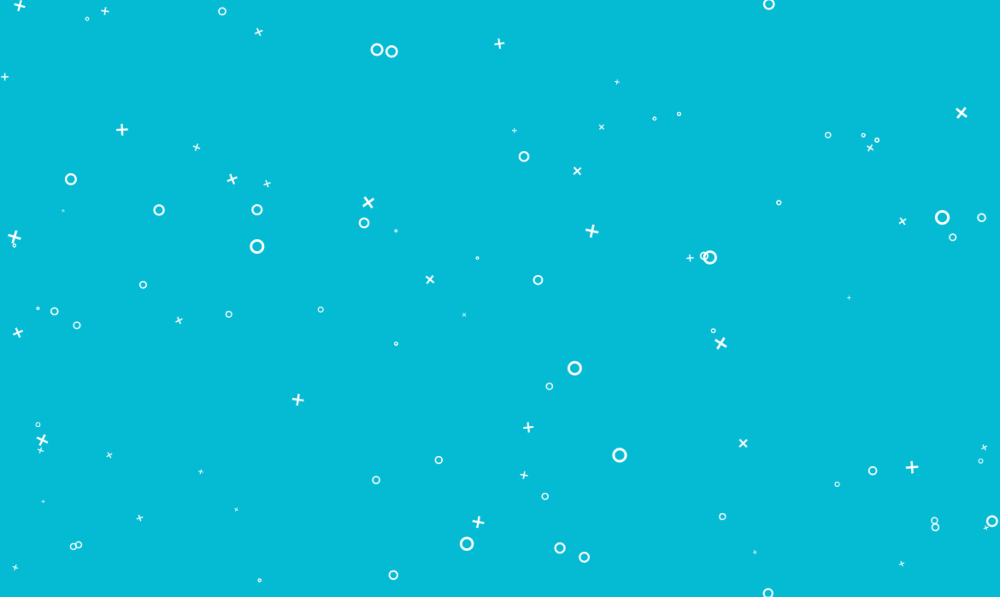

# Задача 3. Анимированный фон

#### В рамках домашнего задания к лекции «Рисование в Canvas»

## Описание

Реализуйте с использованием Canvas API анимированный фон:



## Функционал

Фон должен состоять из крестиков и окружностей разного размера (в дальнейшем — объекты), равномерно распределенных по всему холсту. И плавно перемещающихся по нему.

Центр объекта перемещается функцией времени, при этом для каждого объекта необходимо выбрать случайным образом одну из двух предоставленных функций. Функция времени выбирается при создании объекта и не должна меняться в дальнейшем при анимации.

Функция времени 1:
```javascript
function nextPoint(x, y, time) {
  return {
    x: x + Math.sin((50 + x + (time / 10)) / 100) * 3,
    y: y + Math.sin((45 + x + (time / 10)) / 100) * 4
  };
}
```

Функция времени 2:
```javascript
function nextPoint(x, y, time) {
  return {
    x: x + Math.sin((x + (time / 10)) / 100) * 5,
    y: y + Math.sin((10 + x + (time / 10)) / 100) * 2
  }
}
```

Пример использования:
```javascript
const { x, y } = nextPoint(100, 100, Date.now());
```

При этом вычислять текущее положение каждого объекта необходимо от его изначального положения, а не от измененного в предыдущий тик, так как формула расчета положения задаёт колебания вокруг базовой точки, координаты которой будут первично сгенерированы при создании объекта.

Фон должен перерисовываться со скоростью 20 кадров в секунду.

Для анимации необходимо создать случайное количество объектов в диапазоне от 50 до 200. При этом количество крестиков и кружочков должно быть равным.

## Параметры объектов

У всех объектов должен быть определен относительный размер `size`, случайное число от `0.1` до `0.6` единиц, который влияет на другие параметры объекта. Все объекты имеют белую обводку. Толщина обводки равна `5 * size`.

### Окружность

Радиус круга равен `12 * size`. Окружность закрашивать не нужно.

### Крестик

Сторона крестика равна `20 * size`. У крестика необходимо определить угол поворота от `0` до `360` градусов. Крестик должен медленно поворачиваться со случайной скоростью в диапазоне `-0.2` до `0.2` на тик (один этап перерисовки).

## Реализация

При реализации нельзя изменять HTML-код и CSS-стили.

### В песочнице CodePen

Реализуйте функционал во вкладке JS.

В онлайн-песочнице на [CODEPEN](https://codepen.io/Netology/pen/ypqqyN).

### Локально с использованием git

В репозитории на [GitHub](https://github.com/netology-code/hj-homeworks/tree/master/canvas/background).

Реализацию необходимо поместить в файл `./js/background.js`. Файл уже подключен к документу, поэтому другие файлы изменять не требуется.

## Инструкция по выполнению домашнего задания

### В онлайн-песочнице

Потребуется только ваш браузер.

1. Открыть код в [песочнице](https://codepen.io/Netology/pen/ypqqyN).
2. Нажать кнопку «Fork».
3. Выполнить задание.
4. Нажать кнопку «Save».
5. Скопировать адрес страницы, открытой в браузере.
6. Прислать скопированную ссылку через личный кабинет на сайте [netology.ru](http://netology.ru/).    

### Локально

Потребуются: браузер, редактор кода, система контроля версий [git](https://git-scm.com), установленная локально, и аккаунт на [GitHub](https://github.com/) или [BitBucket](https://bitbucket.org/).

1. Клонировать репозиторий с домашними заданиями `git clone https://github.com/netology-code/hj-homeworks.git`.
2. Перейти в папку задания `cd hj-homeworks/canvas/background`.
3. Выполнить задание.
4. Создать репозиторий на [GitHub](https://github.com/) или [BitBucket](https://bitbucket.org/).
5. Добавить репозиторий в проект `git remote add homeworks %repo-url%`, где `%repo-url%` — адрес созданного репозитория.
6. Опубликовать код в репозиторий `homeworks` с помощью команды `git push -u homeworks master`.
7. Прислать ссылку на репозиторий через личный кабинет на сайте [netology.ru](http://netology.ru/).
