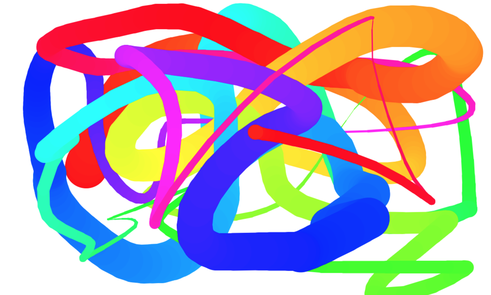

# Задача 2. Рисование в браузере

#### В рамках домашнего задания к лекции «Рисование в Canvas»

## Описание

Реализуйте примитивный инструмент рисования:

## Функционал

При открытии страницы необходимо установить размер холста равным размеру окна браузера. При изменении размеров окна бразуера необходимо обновить размер холста и очистить его.

При движении по холсту мыши с нажатой левой кнопкой необходимо рисовать на холсте линию. Если кнопка мыши отпущена, то линия не рисуется. Если мышь вышла за пределы холста и потом вернулась, линия не рисуется. Для рисования используются координаты положения мыши.

При двойном клике холст необходимо очищать.

## Характеристики линии

Цвет линии задается с помощью [цветовой модели HSL](https://ru.wikipedia.org/wiki/HSL). Насыщенность `100%`, светлота `50%`.

Оттенок меняется при каждом тике на единицу в диапазоне от `0` до `359` включительно. При этом, если нажата клавиша `Shift`, то он уменьшается, иначе увеличивается. Если оттенок достиг максимума или минимума, то значение устанавливается в минимум или максимум соответственно.

Толщина линии меняется при каждом тике на единицу в диапазоне от `5` до `100` включительно. Начинать нужно со `100`. При достижении максимума толщина должна уменьшаться. При достижении минимума — увеличиваться.

Необходимо скруглить края линии, задав свойствам контекста `lineJoin` и `lineCap` значение `round`.

## Реализация

При реализации нельзя изменять HTML-код и CSS-стили.

### В песочнице CodePen

Реализуйте функционал во вкладке JS.

В онлайн-песочнице на [CODEPEN](https://codepen.io/Netology/pen/dJjjyJ).

### Локально с использованием git

В репозитории на [GitHub](https://github.com/netology-code/hj-homeworks/tree/master/canvas/draw).

Реализацию необходимо поместить в файл `./js/draw.js`. Файл уже подключен к документу, поэтому другие файлы изменять не требуется.

## Инструкция по выполнению домашнего задания

### В онлайн-песочнице

Потребуется только ваш браузер.

1. Открыть код в [песочнице](https://codepen.io/Netology/pen/dJjjyJ).
2. Нажать кнопку «Fork».
3. Выполнить задание.
4. Нажать кнопку «Save».
5. Скопировать адрес страницы, открытой в браузере.
6. Прислать скопированную ссылку через личный кабинет на сайте [netology.ru](http://netology.ru/).    

### Локально

Потребуются: браузер, редактор кода, система контроля версий [git](https://git-scm.com), установленная локально, и аккаунт на [GitHub](https://github.com/) или [BitBucket](https://bitbucket.org/).

1. Клонировать репозиторий с домашними заданиями `git clone https://github.com/netology-code/hj-homeworks.git`.
2. Перейти в папку задания `cd hj-homeworks/canvas/draw`.
3. Выполнить задание.
4. Создать репозиторий на [GitHub](https://github.com/) или [BitBucket](https://bitbucket.org/).
5. Добавить репозиторий в проект `git remote add homeworks %repo-url%`, где `%repo-url%` — адрес созданного репозитория.
6. Опубликовать код в репозиторий `homeworks` с помощью команды `git push -u homeworks master`.
7. Прислать ссылку на репозиторий через личный кабинет на сайте [netology.ru](http://netology.ru/).
