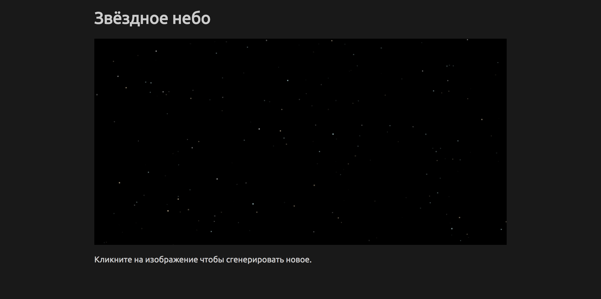

# Задача 1. Генератор звёздного неба

#### В рамках домашнего задания к лекции «Рисование в Canvas»

## Описание

Вам необходимо реализовать генератор звёздного неба:

## Интерфейс

Для рисования используйте тег `<canvas>`.

## Функционал

При открытии и при клике на холст необходимо генерировать новую картинку звёздного неба, отвечающую следующим требованиям:

- Количество звезд на картинке должно быть случайным в диапазоне от `200` до `400` штук.
- Фон звездного неба должен быть чисто чёрным.
- Размер звезды – случайный от `0` до `1.1` точек.
- Цвет звезды – случайный из трёх возможных вариатов: `#ffffff`, `#ffe9c4`, `#d4fbff`.
- Яркость звезды – случайная в диапазоне от `0.8` до `1`. Яркость задаётся свойством `globalAlpha`.
- Расположение каждой звезды – случайное, но в пределах холста.

## Реализация

При реализации нельзя изменять HTML-код и CSS-стили.

### В песочнице CodePen

Реализуйте функционал во вкладке JS.

В онлайн-песочнице на [CODEPEN](https://codepen.io/Netology/pen/eyjjYZ).

### Локально с использованием git

В репозитории на [GitHub](https://github.com/netology-code/hj-homeworks/tree/master/canvas/star-field).

Реализацию необходимо поместить в файл `./js/star.js`. Файл уже подключен к документу, поэтому другие файлы изменять не требуется.

## Инструкция по выполнению домашнего задания

### В онлайн-песочнице

Потребуется только ваш браузер.

1. Открыть код в [песочнице](https://codepen.io/Netology/pen/eyjjYZ).
2. Нажать кнопку «Fork».
3. Выполнить задание.
4. Нажать кнопку «Save».
5. Скопировать адрес страницы, открытой в браузере.
6. Прислать скопированную ссылку через личный кабинет на сайте [netology.ru](http://netology.ru/).    

### Локально

Потребуются: браузер, редактор кода, система контроля версий [git](https://git-scm.com), установленная локально, и аккаунт на [GitHub](https://github.com/) или [BitBucket](https://bitbucket.org/).

1. Клонировать репозиторий с домашними заданиями `git clone https://github.com/netology-code/hj-homeworks.git`.
2. Перейти в папку задания `cd hj-homeworks/canvas/star-field`.
3. Выполнить задание.
4. Создать репозиторий на [GitHub](https://github.com/) или [BitBucket](https://bitbucket.org/).
5. Добавить репозиторий в проект `git remote add homeworks %repo-url%`, где `%repo-url%` — адрес созданного репозитория.
6. Опубликовать код в репозиторий `homeworks` с помощью команды `git push -u homeworks master`.
7. Прислать ссылку на репозиторий через личный кабинет на сайте [netology.ru](http://netology.ru/).
