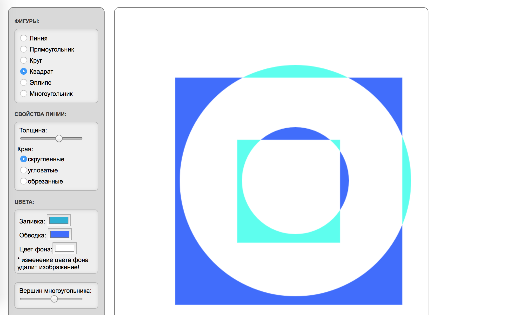
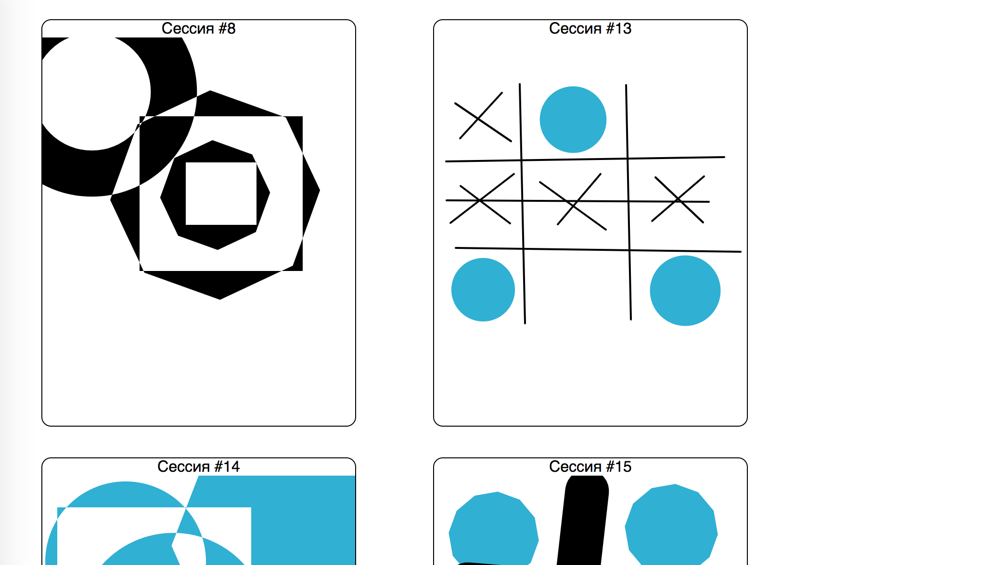

# Задача 2. Коллективное рисование

#### В рамках домашнего задания к лекции «Продвинутая работа с вебсокетами»

## Описание

Вам необходимо доработать приложение, позволяющее рисовать различные фигуры, таким образом, чтобы любой желающий мог следить за процессом рисования:

Текущее состояние должно отображаться на [странице просмотра](https://neto-api.herokuapp.com/hj/4.4/draw/):

## Интерфейс

В глобальном объекте `Window` доступен объект `editor`, который предоставляет интерфейс к графическому редактору.

У объекта `editor` есть событие `update`, которое генерируется каждый раз при внесении изменений на холст. В объекте события будет доступна ссылка на объект `Canvas` в свойстве `canvas`.

## Данные

Для передачи текущего состояния холста вам необходимо установить веб-сокет соединение с `wss://neto-api.herokuapp.com/draw`. Со стороны сервера поступает только одно сообщение — идентификатор сессии, _число_. Вам следует отправлять на сервер текущее состояние холста при каждом изменении в бинарном формате.

Если вы все сделаете верно, то на [странице просмотра](https://neto-api.herokuapp.com/hj/4.4/draw/) будет отображаться текущее состояние вашего холста.

## Реализация

При реализации нельзя изменять HTML-код, CSS-стили и предоставленный JavaScript-код.

### В песочнице CodePen

Реализуйте функционал на вкладке JS.

В онлайн-песочнице на [CODEPEN](https://codepen.io/Netology/pen/dJjjYd).

### Локально с использованием git

В репозитории на [GitHub](https://github.com/netology-code/hj-homeworks/tree/master/comet/draw).

Реализацию необходимо поместить в файл `./js/socket.js`. Файл уже подключен к документу, поэтому другие файлы изменять не требуется.

## Инструкция по выполнению домашнего задания

### В онлайн-песочнице

Потребуется только ваш браузер.

1. Открыть код в [песочнице](https://codepen.io/Netology/pen/dJjjYd).
2. Нажать кнопку «Fork».
3. Выполнить задание.
4. Нажать кнопку «Save».
5. Скопировать адрес страницы, открытой в браузере.
6. Прислать скопированную ссылку через личный кабинет на сайте [netology.ru](http://netology.ru/).    

### Локально

Потребуется: браузер, редактор кода, система контроля версий [git](https://git-scm.com), установленная локально, и аккаунт на [GitHub](https://github.com/) или [BitBucket](https://bitbucket.org/).

1. Клонировать репозиторий с домашними заданиями `git clone https://github.com/netology-code/hj-homeworks.git`.
2. Перейти в папку задания `cd hj-homeworks/comet/draw`.
3. Выполнить задание.
4. Создать репозиторий на [GitHub](https://github.com/) или [BitBucket](https://bitbucket.org/).
5. Добавить репозиторий в проект `git remote add homeworks %repo-url%`, где `%repo-url%` — адрес созданного репозитория.
6. Опубликовать код в репозиторий `homeworks` с помощью команды `git push -u homeworks master`.
7. Прислать ссылку на репозиторий через личный кабинет на сайте [netology.ru](http://netology.ru/).
