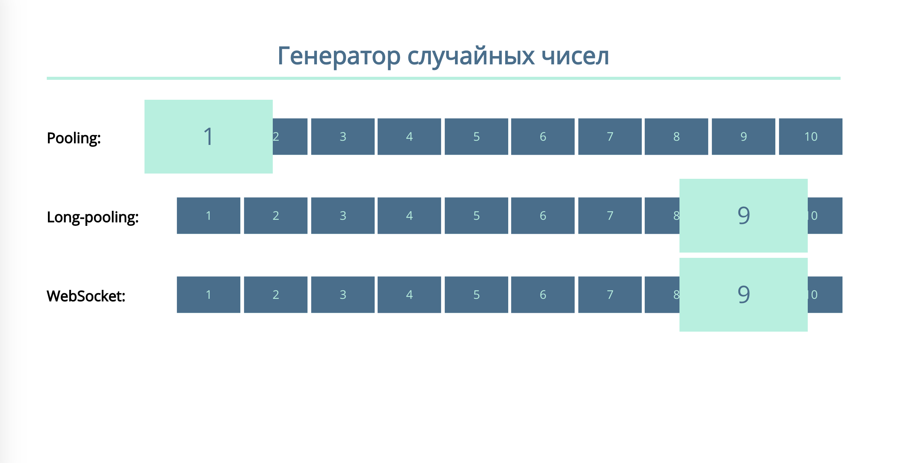

# Задача 3. Генератор случайных чисел

#### В рамках домашнего задания к лекции «Продвинутая работа с вебсокетами»

## Описание

Для наглядной демонстрации работы разных подходов реализации Comet-соединения вам необходимо отображать случайные числа, генерируемые на веб-сервере, организовав их получение, используя «частые опросы», «длинные опросы» и веб-сокеты:

## Интерфейс

Карточки с числами от `1` до `10` заключены в `
`. Набор карточек заключен в тег `<section>`, класс соответствует типу соединения:
- `pooling` — для отображения генератора используются «частые опросы»;
- `long-pooling` — для отображения генератора используются «длинные опросы»;
- `websocket` — для отображения генератора используется веб-сокет соединение.

Для того чтобы выбрать карточку, добавьте ей класс `flip-it`. Чтобы отменить выбор, удалите этот класс.

## Данные

Во всех трех случаях передаётся обычное число от `1` до `10`. Не забудьте обработать все возможные исключительные ситуации.

### Частые опросы

`https://neto-api.herokuapp.com/comet/pooling`

Используйте этот адрес для получения актуального случайного числа с сервера. Можете поэкспериментировать с частотой опросов. Но в конечном решении рекомендуем использовать период не чаще, чем `5` секунд.

### Длинные опросы

`https://neto-api.herokuapp.com/comet/long-pooling`

Для поддержания соединения открытым сервер может дополнить ответ пробельными символами.

### Веб-сокет

`wss://neto-api.herokuapp.com/comet/websocket`

Каждое новое случайное число присылается отдельным сообщением.

## Реализация

При реализации нельзя изменять HTML-код и CSS-стили.

### В песочнице CodePen

Реализуйте функционал на вкладке JS.

В онлайн-песочнице на [CODEPEN](https://codepen.io/Netology/pen/jYppWO).

### Локально с использованием git

В репозитории на [GitHub](https://github.com/netology-code/hj-homeworks/tree/master/comet/random).

Реализуйте решение в файлах `./js/pooling.js`, `./js/long-pooling.js` и `./js/websocket.js` соответственно. Файлы уже подключены к документу, поэтому другие файлы изменять не требуется.

## Инструкция по выполнению домашнего задания

### В онлайн-песочнице

Потребуется только ваш браузер.

1. Открыть код в [песочнице](https://codepen.io/Netology/pen/jYppWO).
2. Нажать кнопку «Fork».
3. Выполнить задание.
4. Нажать кнопку «Save».
5. Скопировать адрес страницы, открытой в браузере.
6. Прислать скопированную ссылку через личный кабинет на сайте [netology.ru](http://netology.ru/).    

### Локально

Потребуются: браузер, редактор кода, система контроля версий [git](https://git-scm.com), установленная локально, и аккаунт на [GitHub](https://github.com/) или [BitBucket](https://bitbucket.org/).

1. Клонировать репозиторий с домашними заданиями `git clone https://github.com/netology-code/hj-homeworks.git`.
2. Перейти в папку задания `cd hj-homeworks/comet/random`.
3. Выполнить задание.
4. Создать репозиторий на [GitHub](https://github.com/) или [BitBucket](https://bitbucket.org/).
5. Добавить репозиторий в проект `git remote add homeworks %repo-url%`, где `%repo-url%` — адрес созданного репозитория.
6. Опубликовать код в репозиторий `homeworks` с помощью команды `git push -u homeworks master`.
7. Прислать ссылку на репозиторий через личный кабинет на сайте [netology.ru](http://netology.ru/).
