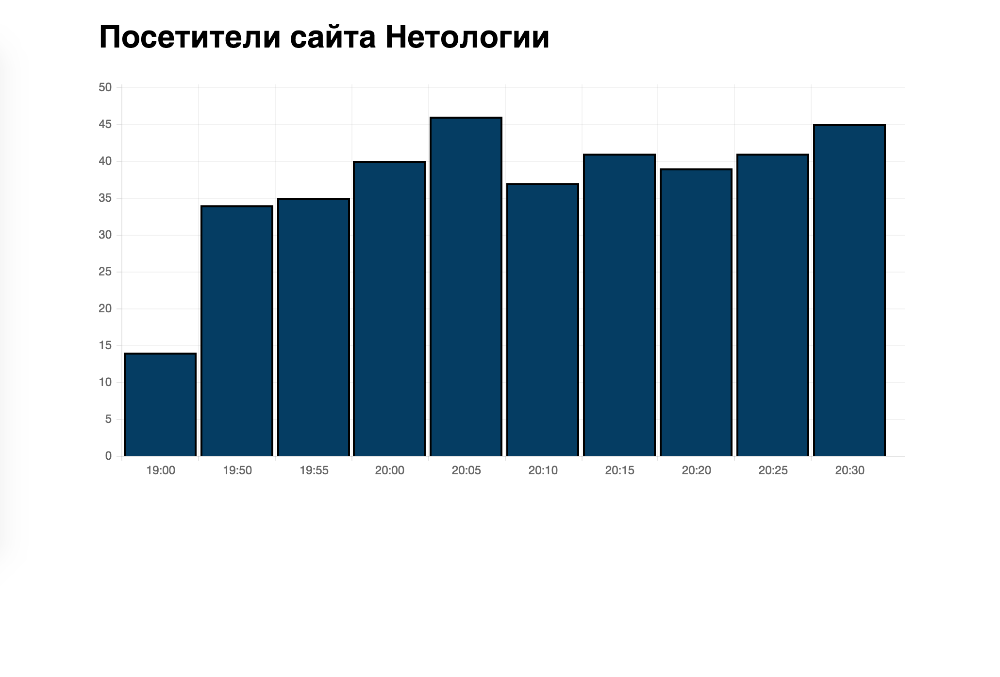

# Задача 1. Посетители сайта в реальном времени

#### В рамках домашнего задания к лекции «Продвинутая работа с вебсокетами»

## Описание

Вам необходимо восстановить работу диаграммы, отображающей количество посетителей на сайте в реальном времени:

## Данные

Для получения данных устанавливается веб-сокет соединение с `wss://neto-api.herokuapp.com/realtime`. В первом сообщении сервер передаёт список измерений за прошлый период. А в последующих — одно текущее измерение.

В изначальной версии веб-сокет сервер передавал данные в виде строки с разделителями: `\n` для измерений, и `|` для того, чтобы отделить метку от данных. Наш backend-разработчик обновил сервер и поменял формат кодирования данных. К сожалению, он серьезно заболел и не оставил никаких описаний нового формата.

Поэтому вам предстоит самостоятельно выяснить, в каком формате передаются данные, и исправить работу приложения.

## Интерфейс

Для отображения гистограммы используется библиотека `Chart.js`. Нет необходимости её подробно изучать, так как вся логика работы с ней уже реализована в программе. И вам лишь нужно передать туда правильные данные. Но чтобы вам было проще понять, что к чему, поясним некоторые моменты.

В переменной `realtime` доступен объект гистограммы, через который можно взаимодействовать с ней. Так как она уже создана и настроена, то нам остаётся только добавлять в неё новые данные.

В переменной `ws` доступен объект веб-сокет соединения. Данные гистограммы обновляются в событии `message` этого соединения.

Переменная `isFirst` позволяет нам отличить первое сообщение от последующих. Далее мы получаем строку через сокет-соединение и разбиваем её на фрагменты, соответствующие измерениям, по символу `\n`. После чего каждый фрагмент разбиваем на метку и значение по символу `|`. И добавляем каждое измерение на гистограмму с помощью метода `addData`. Первым аргументом передаем массив наборов данных (`dataset`), в котором только одно наше значение. Приводим его к числу. Вторым аргументом передаём метку.

При обработке последующих сообщений логика та же, только передаётся всего одно измерение, и поэтому мы пропускаем один этап. Также, чтобы на гистограмме были только последние 10 измерений, мы удаляем то, которое было добавлено первым, с помощью метода `removeData`.

## Реализация

Попробуйте выяснить формат передаваемых данных, не внося изменения в текущий код. И только потом приступайте к переработке скрипта.

### В песочнице CodePen

Реализуйте функционал на вкладке JS.

В онлайн-песочнице на [CODEPEN](https://codepen.io/Netology/pen/MrBBaK).

### Локально с использованием git

В репозитории на [GitHub](https://github.com/netology-code/hj-homeworks/tree/master/comet/realtime).

Реализацию необходимо поместить в файл `./js/realtime.js`. Файл уже подключен к документу, поэтому другие файлы изменять не требуется.

## Инструкция по выполнению домашнего задания

### В онлайн-песочнице

Потребуется только ваш браузер.

1. Открыть код в [песочнице](https://codepen.io/Netology/pen/MrBBaK).
2. Нажать кнопку «Fork».
3. Выполнить задание.
4. Нажать кнопку «Save».
5. Скопировать адрес страницы, открытой в браузере.
6. Прислать скопированную ссылку через личный кабинет на сайте [netology.ru](http://netology.ru/).    

### Локально

Потребуются: браузер, редактор кода, система контроля версий [git](https://git-scm.com), установленная локально, и аккаунт на [GitHub](https://github.com/) или [BitBucket](https://bitbucket.org/).

1. Клонировать репозиторий с домашними заданиями `git clone https://github.com/netology-code/hj-homeworks.git`.
2. Перейти в папку задания `cd hj-homeworks/comet/realtime`.
3. Выполнить задание.
4. Создать репозиторий на [GitHub](https://github.com/) или [BitBucket](https://bitbucket.org/).
5. Добавить репозиторий в проект `git remote add homeworks %repo-url%`, где `%repo-url%` — адрес созданного репозитория.
6. Опубликовать код в репозиторий `homeworks` с помощью команды `git push -u homeworks master`.
7. Прислать ссылку на репозиторий через личный кабинет на сайте [netology.ru](http://netology.ru/).
