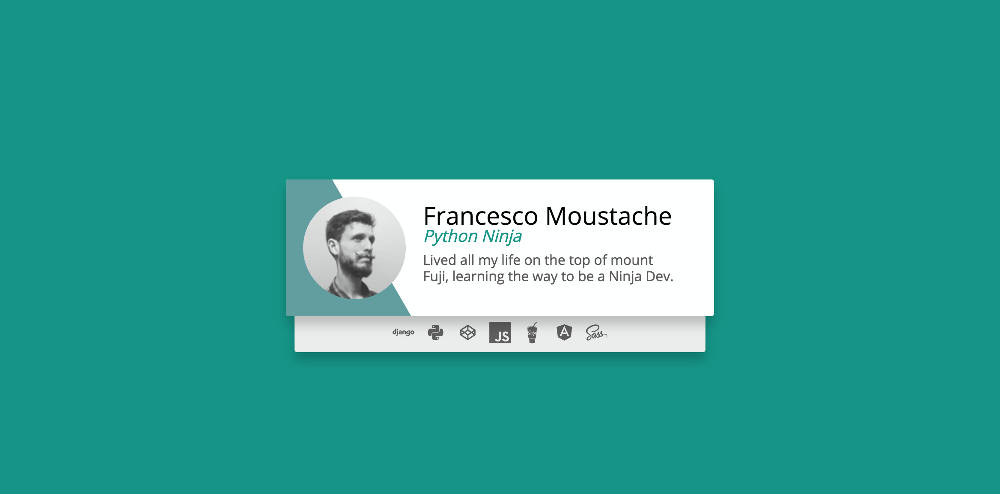

# Задача 2. Профиль пользователя

#### В рамках домашнего задания к лекции «Cовместное использование ресурсов между разными источниками»

## Описание

Вам необходимо реализовать виджет профиля разработчика:



## Данные

Профиль пользователя — это объект со следующими свойствами:
- `id` — идентификатор пользователя;
- `name` — имя пользователя;
- `description` — описание;
- `position` — специализация;
- `pic` — аватар.

Данные профиля доступны в формате JSONP по адресу `https://neto-api.herokuapp.com/profile/me`, имя функции можно передать GET-параметром `callback`.

Список используемых технологий — простой массив строк. Тоже доступен в формате JSONP по адресу `https://neto-api.herokuapp.com/profile/:id/technologies`. `:id` — идентификатор пользователя.

## Интерфейс

При открытии страницы необходимо загрузить данные профиля и список используемых технологий. Подставить полученные данные в интерфейс.

Для подстановки данных профиля в HTML-разметку используйте элементы со следующими атрибутами:
- `data-name` — имя пользователя, подставляйте в тело тега;
- `data-description` — описание пользователя, подставляйте в тело тега;
- `data-pic` — аватар пользователя, подставляйте адрес картинки в атрибут `src`;
- `data-position` — специализация, подставляйте в тело тега;
- `data-technologies` — количество подписчиков, подставляйте в тело тега;
- `data-following` — список используемых технологий, подставляйте в тело тега.

Каждую технологию необходимо представить в виде бейджа со следующим HTML-кодом:
```html
<span class="devicons devicons-django"></span>
```

Тут `django` — строка с названием технологии.

После того как все данные загружены и подставлены, необходимо элементу с классом `content` установить значение стиля `display` в значение `initial`.

## Реализация

При реализации нельзя изменять HTML-код и CSS-стили.

### В песочнице CodePen

Реализуйте функционал вкладке на JS.

В онлайн-песочнице на [CODEPEN](https://codepen.io/Netology/pen/jYppNN).

### Локально с использованием git

Реализацию необходимо поместить в файл `./js/profile.js`. Файл уже подключен к документу, поэтому другие файлы изменять не требуется.

В репозитории на [GitHub](https://github.com/netology-code/hj-homeworks/tree/master/cors/profile).

## Инструкция по выполнению домашнего задания

### В онлайн-песочнице

Потребуется только ваш браузер.

1. Открыть код в [песочнице](https://codepen.io/Netology/pen/jYppNN).
2. Нажать кнопку «Fork».
3. Выполнить задание.
4. Нажать кнопку «Save».
5. Скопировать адрес страницы, открытой в браузере.
6. Прислать скопированную ссылку через личный кабинет на сайте [netology.ru](http://netology.ru/).    

### Локально

Потребу.тся: браузер, редактор кода, система контроля версий [git](https://git-scm.com), установленная локально, и аккаунт на [GitHub](https://github.com/) или [BitBucket](https://bitbucket.org/).

1. Клонировать репозиторий с домашними заданиями `git clone https://github.com/netology-code/hj-homeworks.git`.
2. Перейти в папку задания `cd hj-homeworks/cors/profile`.
3. Выполнить задание.
4. Создать репозиторий на [GitHub](https://github.com/) или [BitBucket](https://bitbucket.org/).
5. Добавить репозиторий в проект `git remote add homeworks %repo-url%`, где `%repo-url%` — адрес созданного репозитория.
6. Опубликовать код в репозиторий `homeworks` с помощью команды `git push -u homeworks master`.
7. Прислать ссылку на репозиторий через личный кабинет на сайте [netology.ru](http://netology.ru/).
