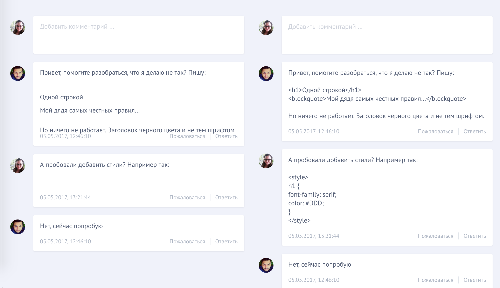

# Задача 1. Испорченные комментарии

#### В рамках домашнего задания к лекции «Создание HTML с нуля»

## Описание

Вам предстоит решить задачу об испорченных комментариях. Слева — как комментарии выглядят сейчас, справа — как они должны выглядеть.

В задаче применён небезопасный `innerHTML`, использование которого не только привело к «порче» текста комментария, но и позволяет осуществить XSS-атаку на пользователей сайта.

## Требования

В целях безопасности нельзя использовать `innerHTML` в этой задаче.

## Реализация

При реализации нельзя изменять HTML-код и CSS-стили.

### В песочнице CodePen

Реализуйте функционал на вкладке JS.

В онлайн-песочнице на [CODEPEN](https://codepen.io/Netology/pen/dJjjPd).

### Локально с использованием git

В репозитории на [GitHub](https://github.com/netology-code/hj-homeworks/tree/master/dom-from-zero/comments).

Реализацию необходимо поместить в файл `./js/comments.js`. Файл уже подключен к документу, поэтому другие файлы изменять не требуется.

## Инструкция по выполнению домашнего задания

### В онлайн-песочнице

Потребуется только ваш браузер.

1. Открыть код в [песочнице](https://codepen.io/Netology/pen/dJjjPd).
2. Нажать кнопку «Fork».
3. Выполнить задание.
4. Нажать кнопку «Save».
5. Скопировать адрес страницы, открытой в браузере.
6. Прислать скопированную ссылку через личный кабинет на сайте [netology.ru](http://netology.ru/).    

### Локально

Потребуются: браузер, редактор кода, система контроля версий [git](https://git-scm.com), установленная локально, и аккаунт на [GitHub](https://github.com/) или [BitBucket](https://bitbucket.org/).

1. Клонировать репозиторий с домашними заданиями `git clone https://github.com/netology-code/hj-homeworks.git`.
2. Перейти в папку задания `cd hj-homeworks/dom-from-zero/comments`.
3. Выполнить задание.
4. Создать репозиторий на [GitHub](https://github.com/) или [BitBucket](https://bitbucket.org/).
5. Добавить репозиторий в проект `git remote add homeworks %repo-url%`, где `%repo-url%` — адрес созданного репозитория.
6. Опубликовать код в репозиторий `homeworks` с помощью команды `git push -u homeworks master`.
7. Прислать ссылку на репозиторий через личный кабинет на сайте [netology.ru](http://netology.ru/).
