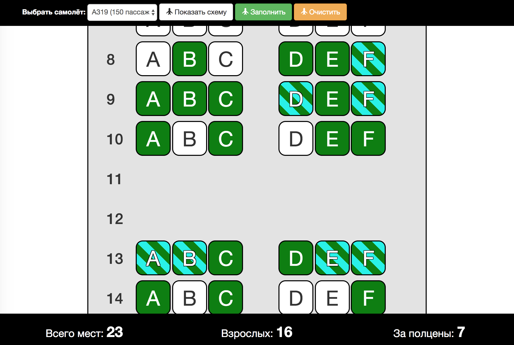

# Задача 2. Схема мест в самолёте

#### В рамках домашнего задания к лекции «Создание HTML с нуля»

## Описание

Необходимо реализовать интерфейс выбора мест в самолёте:



## Данные

Для получения схемы расположения мест в салоне самолета необходимо запросить данные в формате JSON по адресу `https://neto-api.herokuapp.com/plane/:id`, где `:id` — идентификатор самолёта.

В случае успеха вы получите закодированный в JSON объект со следующими свойствами:
* `title` — название самолёта, _строка_;
* `passengers` — общее количество пассажиров, _число_;
* `letters6` — буквенные коды мест в ряду, в котором 6 мест, _массив строк_;
* `letters4` — буквенные коды мест в ряду, в котором 4 места, _массив строк_;
* `scheme` — схема расположения мест, _массив чисел_.

В схеме расположения мест каждый элемент массива представляет собой количество мест в текущем ряду.

## Интерфейс

Поле выбора типа самолёта имеет идентификатор `acSelect`. В качестве значения опции указан идентификатор самолёта.

Кнопка отображения схемы имеет идентификатор `btnSeatMap`. При клике на неё необходимо отобразить схему выбранного самолета и предоставить возможность выбора мест.

Кнопка с идентификатором `btnSetFull` позволяет обозначить все места в самолёте как занятые. Пока не отображена схема самолёта, эта кнопка должна быть заблокирована.

Кнопка `btnSetEmpty` позволяет обозначить все места в самолёте как свободные. Пока не отображена схема самолёта, эта кнопка тоже должна быть заблокирована.

Заголовок с идентификатором `seatMapTitle` используйте для отображения выбранного самолёта и количества пассажиров в нём. Отобразите их в формате: `Airbus A320 (186 пассажиров)`.

Схему мест в самолёте необходимо поместить в тело тега с идентификатором `seatMapDiv`.

Теги с идентификаторами `totalPax`, `totalAdult` и `totalHalf` используются для отображения общего количества занятых мест, мест с полной стоимостью и мест за половину стоимости (детских) соответственно.

Ряд сидений в самолёте должен иметь следующую структуру:
```html
<div class="row seating-row text-center">
  <div class="col-xs-1 row-number">
    <h2 class="">1</h2>
  </div>
  <div class="col-xs-5">
    <div class="col-xs-4 seat">
      <span class="seat-label">A</span>
    </div>
    <div class="col-xs-4 seat">
      <span class="seat-label">B</span>
    </div>
    <div class="col-xs-4 seat">
      <span class="seat-label">C</span>
    </div>
  </div>
  <div class="col-xs-5">
    <div class="col-xs-4 seat">
      <span class="seat-label">D</span>
    </div>
    <div class="col-xs-4 seat">
      <span class="seat-label">E</span>
    </div>
    <div class="col-xs-4 seat">
      <span class="seat-label">F</span>
    </div>
  </div>
</div>
```

В тег `h2` необходимо поместить номер ряда. Нумерация начинается с `1`.

Сиденья группируются по `3` с помощью тега `div.col-xs-5`. В `span.seat-label` необходимо поместить буквенный код места.

Если сиденье в ряду отсутствует, необходимо добавить тег:
```html
<div class="col-xs-4 no-seat"></div>
```

Для того чтобы обозначить сиденье занятым, в тег `div.seat` необходимо добавить класс `adult` для мест с полной стоимостью или `half` для мест за половину цены.

## Функционал

При клике на свободное место левой кнопкой мыши оно обозначается как занятое за полную стоимость. При клике на место левой кнопкой мыши с зажатой клавишей `Alt`, место обозначается занятым за половину цены. При клике на занятое место оно обозначается свободным.

При любых изменениях состояния мест необходимо обновлять количество занятых мест, занятых мест за полную стоимость и занятых мест за половину цены.

## Требования

При реализации приложения недопустимо использовать свойство `innerHTML`.

## Реализация

При реализации нельзя изменять HTML-код и CSS-стили.

### В песочнице CodePen

Реализуйте функционал на вкладке JS.

В онлайн-песочнице на [CODEPEN](https://codepen.io/Netology/pen/bajjNy).

### Локально с использованием git

В репозитории на [GitHub](https://github.com/netology-code/hj-homeworks/tree/master/dom-from-zero/plane).

Реализацию необходимо поместить в файл `./js/scheme.js`. Файл уже подключен к документу, поэтому другие файлы изменять не требуется.

## Инструкция по выполнению домашнего задания

### В онлайн-песочнице

Потребуется только ваш браузер.

1. Открыть код в [песочнице](https://codepen.io/Netology/pen/bajjNy).
2. Нажать кнопку «Fork».
3. Выполнить задание.
4. Нажать кнопку «Save».
5. Скопировать адрес страницы, открытой в браузере.
6. Прислать скопированную ссылку через личный кабинет на сайте [netology.ru](http://netology.ru/).    

### Локально

Потребуются: браузер, редактор кода, система контроля версий [git](https://git-scm.com), установленная локально, и аккаунт на [GitHub](https://github.com/) или [BitBucket](https://bitbucket.org/).

1. Клонировать репозиторий с домашними заданиями `git clone https://github.com/netology-code/hj-homeworks.git`.
2. Перейти в папку задания `cd hj-homeworks/dom-from-zero/plane`.
3. Выполнить задание.
4. Создать репозиторий на [GitHub](https://github.com/) или [BitBucket](https://bitbucket.org/).
5. Добавить репозиторий в проект `git remote add homeworks %repo-url%`, где `%repo-url%` — адрес созданного репозитория.
6. Опубликовать код в репозиторий `homeworks` с помощью команды `git push -u homeworks master`.
7. Прислать ссылку на репозиторий через личный кабинет на сайте [netology.ru](http://netology.ru/).
