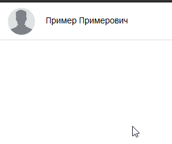

# Задача 1. Список контактов

#### В рамках домашнего задания к лекции «Объектная модель документа»

## Описание

Написать скрипт, который отобразит на странице список контактов на основе данных, полученных из функции `loadContacts`.

Список должен состоять из имен контактов. При клике на имя открывается карточка с контактными данными. Открытие карточки уже реализовано. Можете проверить это на единственном элементе списка контактов, который дан для примера. И все будет работать с добавленными вами контактами, если вы правильно сформируете HTML-код и поместите его в подходящее место.



## Интерфейс

Данные о списке контактов нужно получить из функции `loadContacts`. Она вернет строку, в которой список контактов представлен в формате JSON. Список реализован в виде массива объектов, у каждого объекта доступны свойста:
- `name` — имя контакта;
- `email` — адрес электронной почты;
- `phone` — номер телефона.

С помощью Javascript нужно создать HTML-код каждого элемента списка и поместить их в содержимое тега `<ul class="contacts-list">`. Тот HTML-код, который сейчас содержится в теле списка, нужно затереть. Он дан для примера.

Элементом списка является тег `<li>`, содержащий атрибуты:
1. `data-email`, в который нужно подставить адрес электронной почты из свойства `email` контакта.
2. `data-phone`, в который нужно подставить номер телефона из свойства `phone`.

Внутри тега `<li>` должен находиться тег `<strong>`, содержащий имя контакта из свойства `name`.

Пример правильно созданного элемента списка:
```html
<li data-email="example@gmail.com" data-phone="+7 777 777 77 77">;
   <strong>Пример Примерович</strong>;
</li>;
```

При клике на правильно созданный элемент списка должна открываться карточка контакта, в которой будут отображаться e-mail и телефон. Если карточка не открывается, вероятно вы что-то сделали не так.

## Реализация

Исходный HTML-код изменять запрещено. Допускается только подключить ваш скрипт в него.

### В песочнице CODEPEN

В онлайн-песочнице на [CODEPEN](https://codepen.io/Netology/pen/aEjKZz).

### Локально с использованием git

В репозитории на [GitHub](https://github.com/netology-code/hj-homeworks/tree/master/dom/contact-list/).

## Инструкция по выполнению домашнего задания

### В онлайн-песочнице

Потребуется только ваш браузер.

1. Открыть код в [песочнице](https://codepen.io/Netology/pen/aEjKZz).
2. Нажать кнопку «Fork».
3. Выполнить задание.
4. Нажать кнопку «Save».
5. Скопировать адрес страницы, открытой в браузере.
6. Прислать скопированную ссылку через личный кабинет на сайте [netology.ru](http://netology.ru/).    

### Локально

Потребуются: браузер, редактор кода, система контроля версий [git](https://git-scm.com), установленная локально, и аккаунт на [GitHub](https://github.com/) или [BitBucket](https://bitbucket.org/).

1. Клонировать репозиторий с домашними заданиями `git clone https://github.com/netology-code/hj-homeworks.git`.
2. Перейти в папку задания `cd hj-homeworks/dom/contact-list`.
3. Выполнить задание.
4. Создать репозиторий на [GitHub](https://github.com/) или [BitBucket](https://bitbucket.org/).
5. Добавить репозиторий в проект `git remote add homeworks %repo-url%`, где `%repo-url%` — адрес созданного репозитория.
6. Опубликовать код в репозиторий `homeworks` с помощью команды `git push -u homeworks master`.
7. Прислать ссылку на репозиторий через личный кабинет на сайте [netology.ru](http://netology.ru/).
