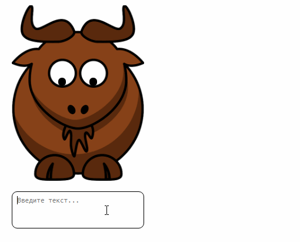

# Задача 3. Ограничение частоты функций

#### В рамках домашнего задания к лекции «Drag & drop»

## Описание

Необходимо реализовать функционал вывода сообщения, которое должно появляться после прекращения ввода текста в текстовое поле:

 

## Интерфейс

1. Изначально  глаза смотрят прямо. Чтобы взгляд смотрел вниз нужно присвоить классу `block` дополнительный класс `active`.
2. Чтобы проявилось сообщение нужно классу `message` присвоить дополнительный класс `view`. 
3. Текстовое поле имеет класс `textarea`.
4. Когда текстовое поле в фокусе зверь должен смотреть вниз. Следовательно убрав фокус с текстового поля зверь должен смотреть прямо. И сообщения быть не должно. 
5. Когда мы печатаем в текстовом поле зверь должен всё время смотреть вниз. После того как пользователь перестаёт печатать через 2 секунды должно появиться сообщение и зверь должен посмотреть прямо. Когда мы снова начинаем вводить текст зверь опят должен смотреть вниз и сообщение должно пропасть ожидая новой задержки в 2 секунды.

Необходимо реализовать это задание так, чтобы функционал вывода сообщения срабатывал не чаще определенной частоты(2 секунды). При вводе текста в текстовое поле программа должна дожидаться окончания группы событий и запускаться один раз.

## Реализация

### В песочнице CODEPEN

В онлайн-песочнице на [CODEPEN](https://codepen.io/Netology/pen/ejLNrX).

### Локально с использованием git

В репозитории на [GitHub](https://github.com/netology-code/hj-homeworks/tree/master/drag-and-drop/limitation).

## Инструкция по выполнению домашнего задания

### В онлайн-песочнице

Потребуется только ваш браузер.

1. Открыть код в [песочнице](https://codepen.io/Traktaran/pen/wxeQvE).
2. Нажать кнопку «Fork».
3. Выполнить задание.
4. Нажать кнопку «Save».
5. Скопировать адрес страницы, открытой в браузере.
6. Прислать скопированную ссылку через личный кабинет на сайте [netology.ru](http://netology.ru/).    

### Локально

Потребуются: браузер, редактор кода, система контроля версий [git](https://git-scm.com), установленная локально, и аккаунт на [GitHub](https://github.com/) или [BitBucket](https://bitbucket.org/).

1. Клонировать репозиторий с домашними заданиями `git clone https://github.com/netology-code/hj-homeworks.git`.
2. Перейти в папку задания `cd hj-homeworks/drag-and-drop/limitation`.
3. Выполнить задание.
4. Создать репозиторий на [GitHub](https://github.com/) или [BitBucket](https://bitbucket.org/).
5. Добавить репозиторий в проект `git remote add homeworks %repo-url%`, где `%repo-url%` — адрес созданного репозитория.
6. Опубликовать код в репозиторий `homeworks` с помощью команды `git push -u homeworks master`.
7. Прислать ссылку на репозиторий через личный кабинет на сайте [netology.ru](http://netology.ru/).