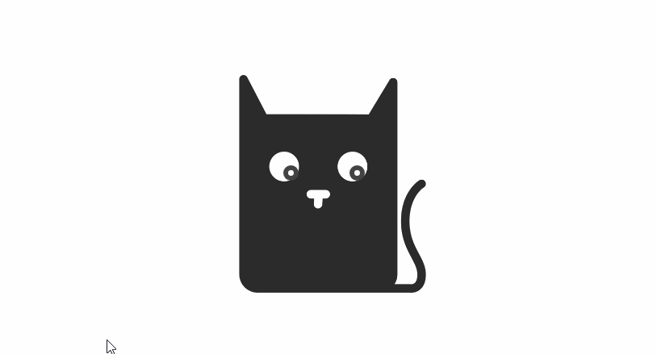
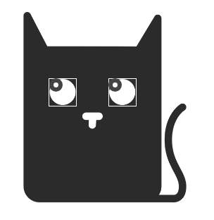

# Задача 2. Отслеживание указателя мыши

#### В рамках домашнего задания к лекции «Drag & drop»

## Описание

Необходимо реализовать функционал движения глаз в сторону курсора в пределах родительскоро блока:

1. Каждый глаз имеет свою обсласть. Область левого глаза имеет класс `cat_position_for_left_eye`, а область правого глаза имеет класс `cat_position_for_right_eye`. Визуально вы можете видеть эти области на картинке:

## Интерфейс

1. Каждый глаз имеет свою область. Область левого глаза имеет класс `cat_position_for_left_eye`, а область правого глаза имеет класс `cat_position_for_right_eye`.
2. Оба глаза имеют одинаковый класс `cat_eye`. 
3. Левый глаз имеет класс `cat_eye_left`.
4. Правый глаз имеет класс `cat_eye_right`.
5. Каждый глаз должен перемещаться независимо от другого.
6. Глаз не должен выходить за пределы родительского блока. 

Необходимо реализовать перемещение глаз в сторону курсора в пределах родительского блока.

## Реализация

### В песочнице CODEPEN

В онлайн-песочнице на [CODEPEN](https://codepen.io/Netology/pen/EpejoB).

### Локально с использованием git

В репозитории на [GitHub](https://github.com/netology-code/hj-homeworks/tree/master/drag-and-drop/tracking-mouse-cursor).

## Инструкция по выполнению домашнего задания

### В онлайн-песочнице

Потребуется только ваш браузер.

1. Открыть код в [песочнице](https://codepen.io/Traktaran/pen/wxeQvE).
2. Нажать кнопку «Fork».
3. Выполнить задание.
4. Нажать кнопку «Save».
5. Скопировать адрес страницы, открытой в браузере.
6. Прислать скопированную ссылку через личный кабинет на сайте [netology.ru](http://netology.ru/).    

### Локально

Потребуются: браузер, редактор кода, система контроля версий [git](https://git-scm.com), установленная локально, и аккаунт на [GitHub](https://github.com/) или [BitBucket](https://bitbucket.org/).

1. Клонировать репозиторий с домашними заданиями `git clone https://github.com/netology-code/hj-homeworks.git`.
2. Перейти в папку задания `cd hj-homeworks/drag-and-drop/tracking-mouse-cursor`.
3. Выполнить задание.
4. Создать репозиторий на [GitHub](https://github.com/) или [BitBucket](https://bitbucket.org/).
5. Добавить репозиторий в проект `git remote add homeworks %repo-url%`, где `%repo-url%` — адрес созданного репозитория.
6. Опубликовать код в репозиторий `homeworks` с помощью команды `git push -u homeworks master`.
7. Прислать ссылку на репозиторий через личный кабинет на сайте [netology.ru](http://netology.ru/).