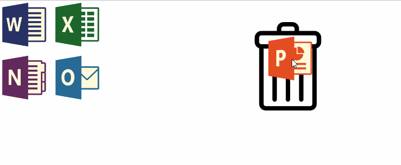

# Задача 1. Мусорная корзина

#### В рамках домашнего задания к лекции «Drag & drop»

## Описание

Необходимо реализовать функционал перетаскивания элементов:

1. Перетаскивание всех элементов с классом `logo`.
2. При захвате элемента курсор должен быть в центре этого элемента.
3. При захвате элемента необходимо присвоить этому элементу класс `moving` и удалить этот класс после отпускания элемента.
4. Удалить элемент(`display: none;`), если он был отпущен в области корзины, которая имеет id `trash_bin`.

## ИнтерфейсА

1. Элементы для перетаскивания имеют класс `logo`.
2. Корзина имеет id `trash_bin`
3. При захвате элемента курсор должен быть в центре этого элемента.
4. При захвате элемента необходимо присвоить этому элементу класс `moving` и удалить этот класс после отпускания элемента.
5. Удалить элемент(`display: none;`), если он был отпущен в области корзины.

## Реализация

### В песочнице CODEPEN

В онлайн-песочнице на [CODEPEN](https://codepen.io/Netology/pen/wxEamp).

### Локально с использованием git

В репозитории на [GitHub](https://github.com/netology-code/hj-homeworks/tree/master/drag-and-drop/trash-bin).

## Инструкция по выполнению домашнего задания

### В онлайн-песочнице

Потребуется только ваш браузер.

1. Открыть код в [песочнице](https://codepen.io/Traktaran/pen/OwgQgj).
2. Нажать кнопку «Fork».
3. Выполнить задание.
4. Нажать кнопку «Save».
5. Скопировать адрес страницы, открытой в браузере.
6. Прислать скопированную ссылку через личный кабинет на сайте [netology.ru](http://netology.ru/).    

### Локально

Потребуются: браузер, редактор кода, система контроля версий [git](https://git-scm.com), установленная локально, и аккаунт на [GitHub](https://github.com/) или [BitBucket](https://bitbucket.org/).

1. Клонировать репозиторий с домашними заданиями `git clone https://github.com/netology-code/hj-homeworks.git`.
2. Перейти в папку задания `cd hj-homeworks/drag-and-drop/trash-bin`.
3. Выполнить задание.
4. Создать репозиторий на [GitHub](https://github.com/) или [BitBucket](https://bitbucket.org/).
5. Добавить репозиторий в проект `git remote add homeworks %repo-url%`, где `%repo-url%` — адрес созданного репозитория.
6. Опубликовать код в репозиторий `homeworks` с помощью команды `git push -u homeworks master`.
7. Прислать ссылку на репозиторий через личный кабинет на сайте [netology.ru](http://netology.ru/).