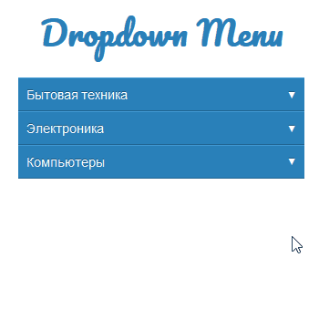

# Задача 1. Меню

#### В рамках домашнего задания к лекции «Принцип обработки событий»

## Описание

Имеется меню навигации по каталогу товаров. Оно уже реализовано. Но имеет ошибку в реализации. При клике на пункты меню первого уровня (синий фон) они просто должны раскрывать, либо схлопываться, если уже раскрыты. При клике на пункты меню второго вровня (серый фон) в дальнейшем будет реализовано отображение товаров в каталоге, сейчас пока название группы просто выводится в консоль:

Проблемы, которые необходимо исправить:
- Браузер переходит по адресу, указанному в атрибуте `href`.
- При клике на пункт меню второго уровня меню первого уровня (синий фон) схлопывается.

Необходимо исправить JavaScript-код таким образом, чтобы при клике на пункт меню второго уровня (серый фон) переход по ссылке не осуществлялся, меню не схлопывалось и оставалось раскрытым. Найдите максимально простое решение.

## Интерфейс

Меню реализовано с помощью тега `<ul>`. Каждый пункт меню — тег `<li>`. Пункт меню, у которого есть вложенное меню, имеет класс `dropdown`. Вложенное меню реализовано с помощью тега `<ul class="dropdown-menu">`. Все пункты меню завернуты в теги `<a>`. Но у пунктов меню, которые раскрывают вложенное меню, добавлен атрибут `data-toggle="dropdown"`.

Для того чтобы показать вложенное меню, необходимо текущему пункту меню `<li>` добавить класс `show`. Чтобы скрыть — добавить класс `hide`.

## Реализация

При реализации нельзя изменять HTML-код и CSS-стили.

### В песочнице CodePen

Реализуйте компонент во вкладке JS.

В онлайн-песочнице на [CODEPEN](https://codepen.io/Netology/pen/LeBrex).

### Локально с использованием git

Реализацию необходимо поместить в файл `./js/menu.js`. Файл уже подключен к документу, поэтому другие файлы изменять не требуется.

В репозитории на [GitHub](https://github.com/netology-code/hj-homeworks/tree/master/event-bubbling-capturing/menu/).

## Инструкция по выполнению домашнего задания

### В онлайн-песочнице

Потребуется только ваш браузер.

1. Открыть код в [песочнице](https://codepen.io/Netology/pen/LeBrex).
2. Нажать кнопку «Fork».
3. Выполнить задание.
4. Нажать кнопку «Save».
5. Скопировать адрес страницы, открытой в браузере.
6. Прислать скопированную ссылку через личный кабинет на сайте [netology.ru](http://netology.ru/).    

### Локально

Потребуются: браузер, редактор кода, система контроля версий [git](https://git-scm.com), установленная локально, и аккаунт на [GitHub](https://github.com/) или [BitBucket](https://bitbucket.org/).

1. Клонировать репозиторий с домашними заданиями `git clone https://github.com/netology-code/hj-homeworks.git`.
2. Перейти в папку задания `cd hj-homeworks/event-bubbling-capturing/menu`.
3. Выполнить задание.
4. Создать репозиторий на [GitHub](https://github.com/) или [BitBucket](https://bitbucket.org/).
5. Добавить репозиторий в проект `git remote add homeworks %repo-url%`, где `%repo-url%` — адрес созданного репозитория.
6. Опубликовать код в репозиторий `homeworks` с помощью команды `git push -u homeworks master`.
7. Прислать ссылку на репозиторий через личный кабинет на сайте [netology.ru](http://netology.ru/).
