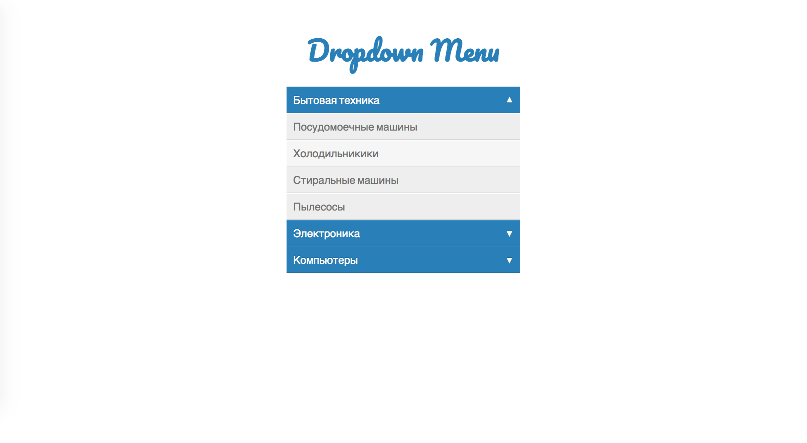

Меню
===

Имеется меню навигации по каталогу товаров. Оно уже реализовано. Но имеет ошибку в реализации. При клике на пункты меню первого уровня (синий фон), они просто должны раскрывать, либо схлопываться, если уже раскрыты. При клике на пункты меню второго вровня (серый фон) в дальнейшем будет реализовано отображение товаров в каталоге, сейчас пока название группы просто выводится в консоль.

Проблемы которые необходимо исправить:
- Браузер переходит по адресу указанному в атрибуте `href`.
- При клике на пункт меню второго уровня меню первого уровня (синий фон) схлопывается.

Необходимо исправить JavaScript-код таким образом, чтобы при клике на пункт меню второго (серый фон) переход по ссылке не осуществлялся, меню не схлопывалось и оставалось раскрытым. Найдите максимально простое решение.

## Интерфейс

Меню реализовано с помощью тега `<ul>`. Каждый пункт меню — тег `<li>`. Пункт меню у которого есть вложенное меню имеет класс `dropdown`. Вложенное меню реализовано с помощью тега `<ul class="dropdown-menu">`. Все пункты меню завернуты в теги `<a>`. Но у пунктов меню, которые раскрывают вложенное меню добавлен атрибут `data-toggle="dropdown"`.

Для того чтобы показать вложенное меню необходимо текущему пункту меню `<li>` добавить класс `show`. Чтобы скрыть, добавить класс `hide`.

## Реализация

При реализации нельзя изменять HTML-код и CSS-стили.

### Локально с использованием git

Реализацию необходимо поместить в файл `./js/menu.js`. Файл уже подключен к документы, поэтому другие файлы изменять не требуется.

### В песочнице CodePen

Реализуйте компонент во вкладке JS. Перед началом работы сделайте форк этого пена:

https://codepen.io/dfitiskin/pen/xrRNQO
