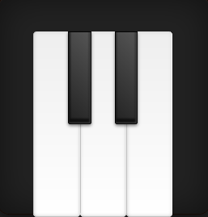

# Задача 1. Пианино

#### В рамках домашнего задания к лекции «Объект события»

## Описание

Реализовать виртуальное пианино из 5 клавиш. Каждая из клавиш при клике проигрывает свой звук:

Пианино имеет 3 набора звуков: `lower`, `middle` и `higher.

Набор по умолчанию — `middle`.

При зажатой кнопке `shift` пианино работает в режиме `lower`.

При зажатой кнопке `alt` пианино работает в режиме `higher.

После того как кнопка `alt` или `shift` отпущена, пианино возвращается в режим `middle`.

## Интерфейс

Для изменения режима, в котором находится пианино, следует менять класс на теге `<ul class="set <mark>middle</mark>">`.

В режиме `lower` класс `.middle` меняется на `.lower`. Для `higher` — аналогично.

Для изменения звука кнопок следует менять `src` у тегов `audio` внутри соответствующих кнопок.

## Материалы

### Звуки клавиш

- lower

1. [Клавиша 1](https://netology-code.github.io/hj-homeworks/event-object/piano/sounds/lower/first.mp3)
2. [Клавиша 2](https://netology-code.github.io/hj-homeworks/event-object/piano/sounds/lower/second.mp3)
3. [Клавиша 3](https://netology-code.github.io/hj-homeworks/event-object/piano/sounds/lower/third.mp3)
4. [Клавиша 4](https://netology-code.github.io/hj-homeworks/event-object/piano/sounds/lower/fourth.mp3)
5. [Клавиша 5](https://netology-code.github.io/hj-homeworks/event-object/piano/sounds/lower/fifth.mp3)

- middle

1. [Клавиша 1](https://netology-code.github.io/hj-homeworks/event-object/piano/sounds/middle/first.mp3)
2. [Клавиша 2](https://netology-code.github.io/hj-homeworks/event-object/piano/sounds/middle/second.mp3)
3. [Клавиша 3](https://netology-code.github.io/hj-homeworks/event-object/piano/sounds/middle/third.mp3)
4. [Клавиша 4](https://netology-code.github.io/hj-homeworks/event-object/piano/sounds/middle/fourth.mp3)
5. [Клавиша 5](https://netology-code.github.io/hj-homeworks/event-object/piano/sounds/middle/fifth.mp3)

- higher

1. [Клавиша 1](https://netology-code.github.io/hj-homeworks/event-object/piano/sounds/higher/first.mp3)
2. [Клавиша 2](https://netology-code.github.io/hj-homeworks/event-object/piano/sounds/higher/second.mp3)
3. [Клавиша 3](https://netology-code.github.io/hj-homeworks/event-object/piano/sounds/higher/third.mp3)
4. [Клавиша 4](https://netology-code.github.io/hj-homeworks/event-object/piano/sounds/higher/fourth.mp3)
5. [Клавиша 5](https://netology-code.github.io/hj-homeworks/event-object/piano/sounds/higher/fifth.mp3)

## Реализация

### В песочнице CODEPEN

В онлайн-песочнице на [CODEPEN](https://codepen.io/Netology/pen/QaBxjB).

### Локально с использованием git

В репозитории на [GitHub](https://github.com/netology-code/hj-homeworks/tree/master/event-object/piano).

## Инструкция по выполнению домашнего задания

### В онлайн-песочнице

Потребуется только ваш браузер.

1. Открыть код в [песочнице](https://codepen.io/Netology/pen/QaBxjB).
2. Нажать кнопку «Fork».
3. Выполнить задание.
4. Нажать кнопку «Save».
5. Скопировать адрес страницы, открытой в браузере.
6. Прислать скопированную ссылку через личный кабинет на сайте [netology.ru](http://netology.ru/).    

### Локально

Потребуются: браузер, редактор кода, система контроля версий [git](https://git-scm.com), установленная локально, и аккаунт на [GitHub](https://github.com/) или [BitBucket](https://bitbucket.org/).

1. Клонировать репозиторий с домашними заданиями `git clone https://github.com/netology-code/hj-homeworks.git`.
2. Перейти в папку задания `cd hj-homeworks/event-object/piano`.
3. Выполнить задание.
4. Создать репозиторий на [GitHub](https://github.com/) или [BitBucket](https://bitbucket.org/).
5. Добавить репозиторий в проект `git remote add homeworks %repo-url%`, где `%repo-url%` — адрес созданного репозитория.
6. Опубликовать код в репозиторий `homeworks` с помощью команды `git push -u homeworks master`.
7. Прислать ссылку на репозиторий через личный кабинет на сайте [netology.ru](http://netology.ru/).
