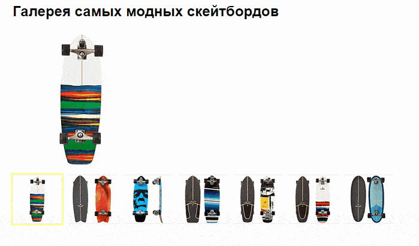

# Задача 2. Галерея скейтбордов

#### В рамках домашнего задания к лекции «Объект события»

## Описание

Реализовать функционал фотогалереи скейтбордов. При клике на минатюру скейтборда происходит его выбор. При этом пользователь видит увеличенную фотографию и название товара:

## Интерфейс

При клике на миниатюру фотографии (тег `a`) товар считается выбранным. Для отображения выбранного товара нужно выполнить несколько условий:

1. Обозначить миниатюру выбранного товара с помощью класса `gallery-current`, установив его на тег `a`. При этом только 1 товар может считаться выбранным и только 1 тег `a` должен иметь такой класс.

2. Отобразить увеличенную фотографию в теге ``, считав ссылку на неё из атрибута `href` тега `a`, при этом сама ссылка не должна открываться.

## Материалы

### Изображения для галереи

- Миниатюры

1. [RESIN](https://netology-code.github.io/hj-homeworks/event-object/skateboard-gallery/images/thumb/01.jpg)
2. [SWALLOW](https://netology-code.github.io/hj-homeworks/event-object/skateboard-gallery/images/thumb/02.jpg)
3. [DA MONSTA](https://netology-code.github.io/hj-homeworks/event-object/skateboard-gallery/images/thumb/03.jpg)
4. [SERAPE](https://netology-code.github.io/hj-homeworks/event-object/skateboard-gallery/images/thumb/04.jpg)
5. [KERRLAGE](https://netology-code.github.io/hj-homeworks/event-object/skateboard-gallery/images/thumb/05.jpg)
6. [USA RESIN](https://netology-code.github.io/hj-homeworks/event-object/skateboard-gallery/images/thumb/06.jpg)
7. [EGGBEATER](https://netology-code.github.io/hj-homeworks/event-object/skateboard-gallery/images/thumb/07.jpg)

- Большие картинки

1. [RESIN](https://netology-code.github.io/hj-homeworks/event-object/skateboard-gallery/images/full/01.jpg)
2. [SWALLOW](https://netology-code.github.io/hj-homeworks/event-object/skateboard-gallery/images/full/02.jpg)
3. [DA MONSTA](https://netology-code.github.io/hj-homeworks/event-object/skateboard-gallery/images/full/03.jpg)
4. [SERAPE](https://netology-code.github.io/hj-homeworks/event-object/skateboard-gallery/images/full/04.jpg)
5. [KERRLAGE](https://netology-code.github.io/hj-homeworks/event-object/skateboard-gallery/images/full/05.jpg)
6. [USA RESIN](https://netology-code.github.io/hj-homeworks/event-object/skateboard-gallery/images/full/06.jpg)
7. [EGGBEATER](https://netology-code.github.io/hj-homeworks/event-object/skateboard-gallery/images/full/07.jpg)

## Реализация

### В песочнице CODEPEN

В онлайн-песочнице на [CODEPEN](https://codepen.io/Netology/pen/mpjKVw).

### Локально с использованием git

В репозитории на [GitHub](https://github.com/netology-code/hj-homeworks/tree/master/event-object/skateboard-gallery).

## Инструкция по выполнению домашнего задания

### В онлайн-песочнице

Потребуется только ваш браузер.

1. Открыть код в [песочнице](https://codepen.io/Netology/pen/mpjKVw).
2. Нажать кнопку «Fork».
3. Выполнить задание.
4. Нажать кнопку «Save».
5. Скопировать адрес страницы, открытой в браузере.
6. Прислать скопированную ссылку через личный кабинет на сайте [netology.ru](http://netology.ru/).    

### Локально

Потребуются: браузер, редактор кода, система контроля версий [git](https://git-scm.com), установленная локально, и аккаунт на [GitHub](https://github.com/) или [BitBucket](https://bitbucket.org/).

1. Клонировать репозиторий с домашними заданиями `git clone https://github.com/netology-code/hj-homeworks.git`.
2. Перейти в папку задания `cd hj-homeworks/event-object/skateboard-gallery`.
3. Выполнить задание.
4. Создать репозиторий на [GitHub](https://github.com/) или [BitBucket](https://bitbucket.org/).
5. Добавить репозиторий в проект `git remote add homeworks %repo-url%`, где `%repo-url%` — адрес созданного репозитория.
6. Опубликовать код в репозиторий `homeworks` с помощью команды `git push -u homeworks master`.
7. Прислать ссылку на репозиторий через личный кабинет на сайте [netology.ru](http://netology.ru/).
