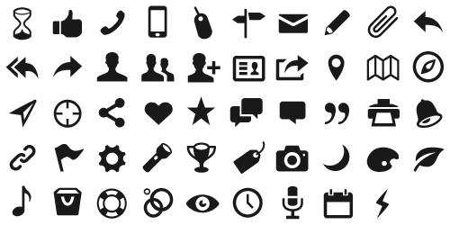
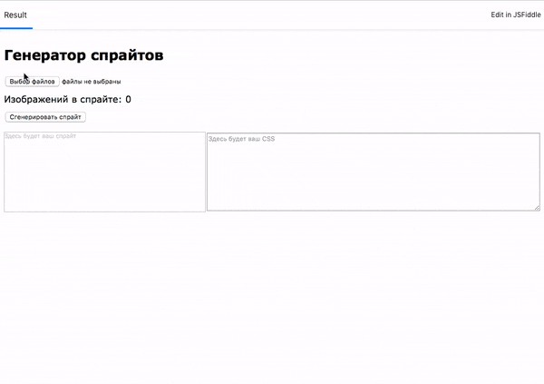

# Генератор спрайтов

Необходимо разработать генератор спрайтов.

## Теория

Спрайт - изображение, составленное из набора маленьких. Обычно включает css-файл 
с классами, указывающими на размеры и расположение каждой составной картинки. 

Наличие одной картинки вместо многих ускоряет загрузку сайта, т.к. не требуется 
загрузки большого количества дополнительных изображений.

Пример изображения:



пример css-кода:

```css
.icon {
  display: inline-block;
  background-image: url(img/sprite.png);
}

.icon_like {
  background-position: -48px 0;
  width: 50px;
  height: 50px;
}
```

Пример использования HTML:

```html
<i class="icon icon_like"></i>
```

[полный код примера](https://jsfiddle.net/usefulwebit/Lt7d4h6a/)

## Описание задания

Работа генератора следующая:

1. С помощью кнопки «Загрузить изображения» (input[multiple]), 
пользователь выбирает несколько картинок
2. При нажатии на кнопку «Сгенерировать спрайт», пользователь 
получает прямо на странице готовое изображение и содержимое 
css-файла для встраивания на сайт.
3. Пользователь может делать дозагрузку картинок, выбрав сначала одни, а следом
другие изображения.

## Пример работы



## Степени сложности

1. Базовый - результирующая картинка выстраивается в одну линию 
(очень длинная или очень высокая), т.е. каждая следующая картинка встает 
в тот же ряд или в ту же колонку в изобаражении (как в примере работы).
2. Со звёздочкой: результирующее изображение имеет приблизительно 
равные ширину и высоту для того, чтобы занимать меньше места (как на первой картинке).

## Подсказка

Для генерации общего изображения вам понадобятся знания, полученные 
в лекции «Рисование в Canvas».

## Рекомендации

Подключение обработчиков событий следует описывать в методе *registerEvents*

## Инструкция по выполнению домашнего задания

### В онлайн-песочнице

Потребуется только ваш браузер.

1. Открыть код в [песочнице](https://jsfiddle.net/usefulwebit/pgk2rmqj/).
2. Нажать кнопку «Fork».
3. Выполнить задание.
4. Нажать кнопку «Save».
5. Скопировать адрес страницы, открытой в браузере.
6. Прислать скопированную ссылку через личный кабинет на сайте [netology.ru](http://netology.ru/).    

### Локально

Потребуются: браузер, редактор кода, система контроля версий [git](https://git-scm.com), установленная локально, и аккаунт на [GitHub](https://github.com/) или [BitBucket](https://bitbucket.org/).

1. Клонировать репозиторий с домашними заданиями `git clone https://github.com/netology-code/hj-homeworks.git`.
2. Перейти в папку задания `cd hj-homeworks/file-api/sprite-generator`.
3. Выполнить задание.
4. Создать репозиторий на [GitHub](https://github.com/) или [BitBucket](https://bitbucket.org/).
5. Добавить репозиторий в проект `git remote add homeworks %repo-url%`, где `%repo-url%` — адрес созданного репозитория.
6. Опубликовать код в репозиторий `homeworks` с помощью команды `git push -u homeworks master`.
7. Прислать ссылку на репозиторий через личный кабинет на сайте [netology.ru](http://netology.ru/).

