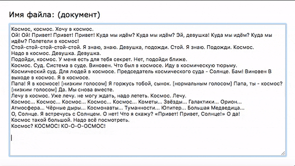

# Текстовый редактор.

**В рамках домашнего задания к лекции «File API»**

## Описание

Имеется онлайн-текстовый редактор с возможностью сохранения данных в локальное хранилище при вводе текста и выгрузке данных оттуда при повторном посещении страницы.

Необходимо реализовать следующие задачи:

1. При переносе текстового файла с расширением *.txt* в окно редактора 
необходимо прочитать его содержимое и перенести в содержимое редактора.
2. В момент переноса файла над окном редактора, поверх него должна появляться 
подсказка «Перенесите и отпустите файл для загрузки .txt содержимого в редактор»
3. Выводить сообщение о том, что файл не может быть прочитан в случае,
если он имеет неподходящее расширение.
4. После загрузки файла, его имя должно подставляться в заголовок редактора

## Пример готовой работы

## Рекомендации 

В редакторе (основа которого доступна [по ссылке](https://jsfiddle.net/usefulwebit/z3yscfgu/))
в настоящий момент созданы пустые методы, которые нужно заполнить:

1. loadFile - для загрузки файла после переноса в окно редактора
2. readFile - для чтения .txt файла
3. setFilename - для установки имени файла
4. showHint/hideHint - для показа/скрытия подсказки

Подключение обработчиков событий следует описывать в методе *registerEvents*

В основе, которая предлагается вам для доработки, уже предусмотрен 
класс *text-editor__hint_visible*, который рекомендуется ставить элементу
\
 в момент переноса файла над окном редактора.

## Инструкция по выполнению домашнего задания

### В онлайн-песочнице

Потребуется только ваш браузер.

1. Открыть код в [песочнице](https://jsfiddle.net/usefulwebit/z3yscfgu/).
2. Нажать кнопку «Fork».
3. Выполнить задание.
4. Нажать кнопку «Save».
5. Скопировать адрес страницы, открытой в браузере.
6. Прислать скопированную ссылку через личный кабинет на сайте [netology.ru](http://netology.ru/).    

### Локально

Потребуются: браузер, редактор кода, система контроля версий [git](https://git-scm.com), установленная локально, и аккаунт на [GitHub](https://github.com/) или [BitBucket](https://bitbucket.org/).

1. Клонировать репозиторий с домашними заданиями `git clone https://github.com/netology-code/hj-homeworks.git`.
2. Перейти в папку задания `cd hj-homeworks/file-api/text-editor`.
3. Выполнить задание.
4. Создать репозиторий на [GitHub](https://github.com/) или [BitBucket](https://bitbucket.org/).
5. Добавить репозиторий в проект `git remote add homeworks %repo-url%`, где `%repo-url%` — адрес созданного репозитория.
6. Опубликовать код в репозиторий `homeworks` с помощью команды `git push -u homeworks master`.
7. Прислать ссылку на репозиторий через личный кабинет на сайте [netology.ru](http://netology.ru/).
