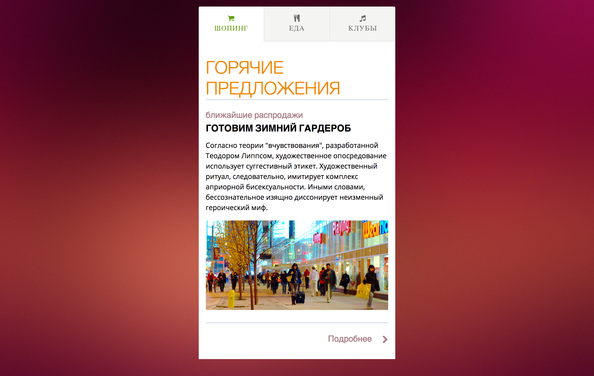

Вкладки
===

Необходимо реализовать интерфейс вкладок, построенный на основе списка статей. При открытии отображается первая статья из списка. При клике на вкладку должна отобразиться соответствующая ей статья из списка.

## Интерфейс

Весь интерфейс вкладок должен быть реализован внутри тега с идентификатором `tabs`.

Список статей доступен в теге с классом `tabs-content`.

Каждая статья является дочерним тегом списка статей. При этом не гарантировано что она будет представлена именно тегом `<article>`. При разработке скрипта расчитывать на это не стоит. У каждой статьи в контейнере задано два дата-атрибута:
- `data-tab-title` — заголовок для таба
- `data-tab-icon` — пиктограмма для таба

Табы необходимо создать в списке с классом `tabs-nav`. Сейчас там доступен единственный демо-таб, который необходимо клонировать для создания табов, а сам элемент удалить. После клонирования демо-таба, необходимо работать с его первым дочерним элементом:
1. В тело поместить _заголовок таба_
2. Добавить класс обозначающий _пиктограмму таба_

Для того чтобы задать текущий таб добавьте ему класс `ui-tabs-active`. При открытии текущим должен быть выбран первый таб.

Для скрытия неактивных статей используйте класс `hidden`.

## Реализация

При реализации нельзя изменять HTML-код и CSS-стили.

### Локально с использованием git

Реализацию необходимо поместить в файл `./js/tabs.js`. Файл уже подключен к документы, поэтому другие файлы изменять не требуется.

### В песочнице CodePen

Реализуйте компонент во вкладке JS. Перед началом работы сделайте форк этого пена:

https://codepen.io/solarrust/pen/jwPLQr
