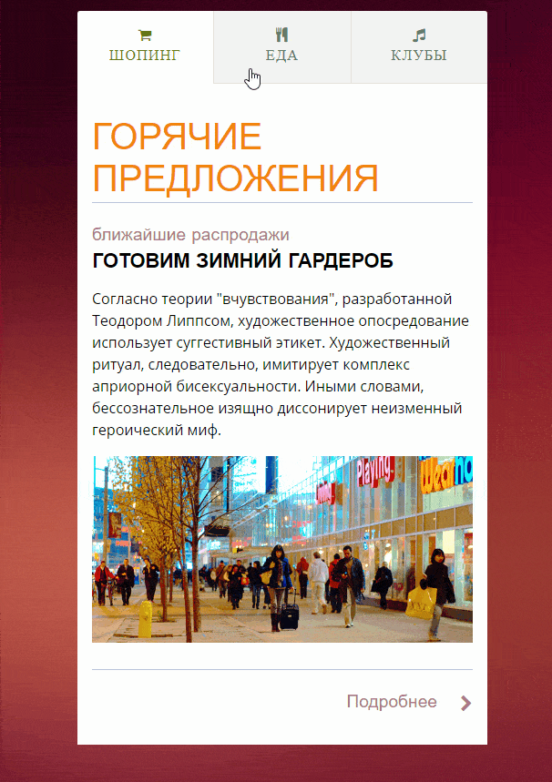

# Задача 3. Вкладки

#### В рамках домашнего задания к лекции «Изменение структуры HTML-документа»

## Описание

Необходимо реализовать интерфейс вкладок, построенный на основе списка статей. При открытии отображается первая статья из списка. При клике на вкладку должна отобразиться соответствующая ей статья из списка:

## Интерфейс

Весь интерфейс вкладок должен быть реализован внутри тега с идентификатором `tabs`.

Список статей доступен в теге с классом `tabs-content`.

Каждая статья является дочерним тегом списка статей. При этом не гарантировано, что она будет представлена именно тегом `<article>`. При разработке скрипта рассчитывать на это не стоит. У каждой статьи в контейнере задано два дата-атрибута:
- `data-tab-title` — заголовок для таба;
- `data-tab-icon` — пиктограмма для таба.

Табы необходимо создать в списке с классом `tabs-nav`. Сейчас там доступен единственный демо-таб, который необходимо клонировать для создания табов, а сам элемент удалить. После клонирования демо-таба необходимо работать с его первым дочерним элементом:
1. В тело поместить _заголовок таба_.
2. Добавить класс, обозначающий _пиктограмму таба_.

Для того, чтобы задать текущий таб, добавьте ему класс `ui-tabs-active`. При открытии текущим должен быть выбран первый таб.

Для скрытия неактивных статей используйте класс `hidden`.

## Реализация

При реализации нельзя изменять HTML-код и CSS-стили.

### В песочнице CodePen

Реализуйте компонент во вкладке JS.

В онлайн-песочнице на [CODEPEN](https://codepen.io/solarrust/pen/jwPLQr).

### Локально с использованием git

Реализацию необходимо поместить в файл `./js/tabs.js`. Файл уже подключен к документу, поэтому другие файлы изменять не требуется.

В репозитории на [GitHub](https://github.com/netology-code/hj-homeworks/tree/master/html-document-structure/tabs).

## Инструкция по выполнению домашнего задания

### В онлайн-песочнице

Потребуется только ваш браузер.

1. Открыть код в [песочнице](https://codepen.io/solarrust/pen/jwPLQr).
2. Нажать кнопку «Fork».
3. Выполнить задание.
4. Нажать кнопку «Save».
5. Скопировать адрес страницы, открытой в браузере.
6. Прислать скопированную ссылку через личный кабинет на сайте [netology.ru](http://netology.ru/).    

### Локально

Потребуются: браузер, редактор кода, система контроля версий [git](https://git-scm.com), установленная локально, и аккаунт на [GitHub](https://github.com/) или [BitBucket](https://bitbucket.org/).

1. Клонировать репозиторий с домашними заданиями `git clone https://github.com/netology-code/hj-homeworks.git`.
2. Перейти в папку задания `cd hj-homeworks/html-document-structure/tabs`.
3. Выполнить задание.
4. Создать репозиторий на [GitHub](https://github.com/) или [BitBucket](https://bitbucket.org/).
5. Добавить репозиторий в проект `git remote add homeworks %repo-url%`, где `%repo-url%` — адрес созданного репозитория.
6. Опубликовать код в репозиторий `homeworks` с помощью команды `git push -u homeworks master`.
7. Прислать ссылку на репозиторий через личный кабинет на сайте [netology.ru](http://netology.ru/).
