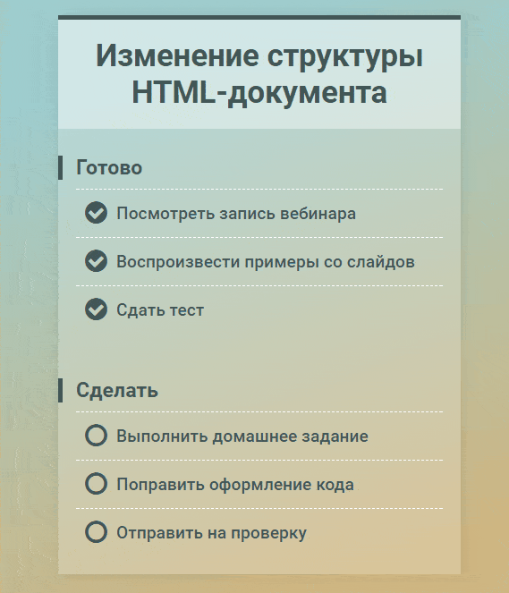

# Задача 2. Список дел (версия 2)

#### В рамках домашнего задания к лекции «Изменение структуры HTML-документа»

## Описание

Необходимо реализовать список дел, представляющий дела в виде двух групп: «Готово» и «Сделать». Если отметить дело в списке «Сделать» как выполненное, оно должно переместиться в список «Готово». Аналогично, дела, помеченные как не выполненные в списке «Готово», перемещаются в список «Сделать»:

## Интерфейс

Сам список дел представлен в теге с классом `todo-list`. В нём есть два тега с классами `done` и `undone`, в которые необходимо помещать выполненные и невыполненные дела соответственно. Каждое дело в списке представлено тегом `<label>`, внутри которого доступен тег `<input type="checkbox">`, отвечающий за его состояние. Выбранный чекбокс (`checked`) соответствует выполненному делу.

Ваш код не должен затрагивать элементы документа вне списка дел.

## Реализация

При реализации нельзя изменять HTML-код и CSS-стили.

### В песочнице CodePen

Реализуйте компонент во вкладке JS.

В онлайн-песочнице на [CODEPEN](https://codepen.io/solarrust/pen/EXjvLb).

### Локально с использованием git

Реализацию необходимо поместить в файл `./js/todo.js`. Файл уже подключен к документу, поэтому другие файлы изменять не требуется.

В репозитории на [GitHub](https://github.com/netology-code/hj-homeworks/tree/master/html-document-structure/todo-list).

## Инструкция по выполнению домашнего задания

### В онлайн-песочнице

Потребуется только ваш браузер.

1. Открыть код в [песочнице](https://codepen.io/solarrust/pen/EXjvLb).
2. Нажать кнопку «Fork».
3. Выполнить задание.
4. Нажать кнопку «Save».
5. Скопировать адрес страницы, открытой в браузере.
6. Прислать скопированную ссылку через личный кабинет на сайте [netology.ru](http://netology.ru/).    

### Локально

Потребуются: браузер, редактор кода, система контроля версий [git](https://git-scm.com), установленная локально, и аккаунт на [GitHub](https://github.com/) или [BitBucket](https://bitbucket.org/).

1. Клонировать репозиторий с домашними заданиями `git clone https://github.com/netology-code/hj-homeworks.git`.
2. Перейти в папку задания `cd hj-homeworks/html-document-structure/todo-list`.
3. Выполнить задание.
4. Создать репозиторий на [GitHub](https://github.com/) или [BitBucket](https://bitbucket.org/).
5. Добавить репозиторий в проект `git remote add homeworks %repo-url%`, где `%repo-url%` — адрес созданного репозитория.
6. Опубликовать код в репозиторий `homeworks` с помощью команды `git push -u homeworks master`.
7. Прислать ссылку на репозиторий через личный кабинет на сайте [netology.ru](http://netology.ru/).
