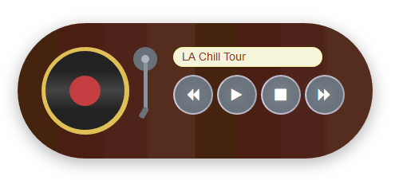

# Задача 3. Аудиоплеер

#### В рамках домашнего задания к лекции «Способы поиска нужного HTML-элемента»

## Описание

Необходимо реализовать функционал четырёх кнопок аудиоплеера:

1. `Play` – начинает играть текущая песня, состояние кнопки меняется на `Pause`.
2. `Pause` – останавливается воспроизведение текущей песни, состояние кнопки меняется на `Play`. При нажатии на кнопку `Play` воспроизведение начнется с момента, на котором было остановлено.
3. `Stop` – останавливает воспроизведение текущей песни, состояние кнопки не меняется. При нажатии на кнопку `Play` воспроизведение начинается с начала песни.
4. `Back` – происходит переключение на предыдущую песню.
5. `Next` – происходит переключение на следующую песню.

Песни должны листаться по кругу с помощью кнопок `Back` и `Next`.

По окончании проигрывания текущей песни автопереключения на следующую не происходит.

## Интерфейс

1. `Play`

`<i class="fa fa-play"></i>`, вложенный в кнопку `<button class="playstate">`

2. `Pause`

`<i class="fa fa-pause"></i>`, вложенный в кнопку `<button class="playstate">`

3. `Stop` `<button class="stop">`

4. `Back` `<button class="back">`

5. `Next` `<button class="next">`

Нужно реализовать функционал кнопок аудиоплеера, управляя свойствами тега `audio`. Визуальное отображение проигрывания песни происходит с помощью добавления или удаления класса `play` на элементе `
`.

Дополнительно, при переключении песен при помощи кнопок `Back` и `Next` нужно выводить название песни с помощью обновления свойства `title` у тега ``.

## Материалы

### Песни для плеера

1. [LA Chill Tour](https://netology-code.github.io/hj-homeworks/html-element-collection/audioplayer/mp3/LA Chill Tour.mp3)
2. [This is it band](https://netology-code.github.io/hj-homeworks/html-element-collection/audioplayer/mp3/This is it band.mp3)
3. [LA Fusion Jam](https://netology-code.github.io/hj-homeworks/html-element-collection/audioplayer/mp3/LA Fusion Jam.mp3)

## Реализация

### В песочнице CODEPEN

В онлайн-песочнице на [CODEPEN](https://codepen.io/Netology/pen/eyjKNo).

### Локально с использованием git

В репозитории на [GitHub](https://github.com/netology-code/hj-homeworks/tree/master/html-element-collection/audioplayer).

## Инструкция по выполнению домашнего задания

### В онлайн-песочнице

Потребуется только ваш браузер.

1. Открыть код в [песочнице](https://codepen.io/Netology/pen/eyjKNo).
2. Нажать кнопку «Fork».
3. Выполнить задание.
4. Нажать кнопку «Save».
5. Скопировать адрес страницы, открытой в браузере.
6. Прислать скопированную ссылку через личный кабинет на сайте [netology.ru](http://netology.ru/).    

### Локально

Потребуются: браузер, редактор кода, система контроля версий [git](https://git-scm.com), установленная локально, и аккаунт на [GitHub](https://github.com/) или [BitBucket](https://bitbucket.org/).

1. Клонировать репозиторий с домашними заданиями `git clone https://github.com/netology-code/hj-homeworks.git`.
2. Перейти в папку задания `cd hj-homeworks/html-element-collection/audioplayer`.
3. Выполнить задание.
4. Создать репозиторий на [GitHub](https://github.com/) или [BitBucket](https://bitbucket.org/).
5. Добавить репозиторий в проект `git remote add homeworks %repo-url%`, где `%repo-url%` — адрес созданного репозитория.
6. Опубликовать код в репозиторий `homeworks` с помощью команды `git push -u homeworks master`.
7. Прислать ссылку на репозиторий через личный кабинет на сайте [netology.ru](http://netology.ru/).
