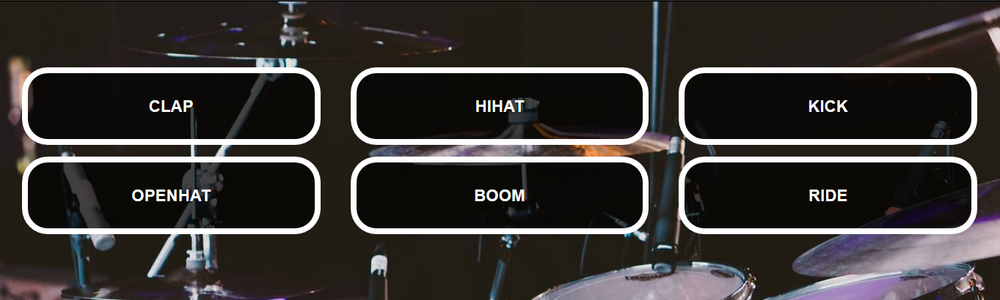

# Задача 2. Ударная установка

#### В рамках домашнего задания к лекции «Способы поиска нужного HTML-элемента»

## Описание

При клике по кнопке `<li class="drum-kit__drum">` с названием звука воспроизвести соответствующий звук.

## Интерфейс

Для проигрывания звука следует обращаться к тегу `audio`, установленному в кнопке.

## Материалы

### Звуки для ударной установки

1. [Звук Clap](https://netology-code.github.io/hj-homeworks/html-element-collection/drum-machine/wav/clap.wav)

2. [Звук Hihat](https://netology-code.github.io/hj-homeworks/html-element-collection/drum-machine/wav/hihat.wav)  

3. [Звук Kick](https://netology-code.github.io/hj-homeworks/html-element-collection/drum-machine/wav/kick.wav)

4. [Звук Openhat](https://netology-code.github.io/hj-homeworks/html-element-collection/drum-machine/wav/openhat.wav)

5. [Звук Boom](https://netology-code.github.io/hj-homeworks/html-element-collection/drum-machine/wav/boom.wav)

6. [Звук Ride](https://netology-code.github.io/hj-homeworks/html-element-collection/drum-machine/wav/ride.wav)

## Реализация

### В песочнице CODEPEN

В онлайн-песочнице на [CODEPEN](https://codepen.io/Netology/pen/xpJzGb).

### Локально с использованием git

В репозитории на [GitHub](https://github.com/netology-code/hj-homeworks/tree/master/html-element-collection/drum-machine).

## Инструкция по выполнению домашнего задания

### В онлайн-песочнице

Потребуется только ваш браузер.

1. Открыть код в [песочнице](https://codepen.io/Netology/pen/xpJzGb).
2. Нажать кнопку «Fork».
3. Выполнить задание.
4. Нажать кнопку «Save».
5. Скопировать адрес страницы, открытой в браузере.
6. Прислать скопированную ссылку через личный кабинет на сайте [netology.ru](http://netology.ru/).    

### Локально

Потребуются: браузер, редактор кода, система контроля версий [git](https://git-scm.com), установленная локально, и аккаунт на [GitHub](https://github.com/) или [BitBucket](https://bitbucket.org/).

1. Клонировать репозиторий с домашними заданиями `git clone https://github.com/netology-code/hj-homeworks.git`.
2. Перейти в папку задания `cd hj-homeworks/browser/errors`.
3. Выполнить задание.
4. Создать репозиторий на [GitHub](https://github.com/) или [BitBucket](https://bitbucket.org/).
5. Добавить репозиторий в проект `git remote add homeworks %repo-url%`, где `%repo-url%` — адрес созданного репозитория.
6. Опубликовать код в репозиторий `homeworks` с помощью команды `git push -u homeworks master`.
7. Прислать ссылку на репозиторий через личный кабинет на сайте [netology.ru](http://netology.ru/).
