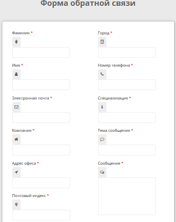

# Задача 3. Форма обратной связи

#### В рамках домашнего задания к лекции «Работа с HTML-формами»

## Описание

Необходимо реализовать работу формы обратной связи. Она должна соответствовать следующим требованиям:

- Кнопка «Отправить сообщение» должна стать доступной, только если заполнены все поля формы.
- В поле «Почтовый индекс» необходимо запретить ввод чего-либо, кроме цифр. При этом все управляющие клавиши, например, `Enter`,  `Delete`, `BackSpace` и клавиши стрелок, должны работать.
- При отправке формы сама форма скрывается и показывается блок сообщения с заголовком «Ваше сообщение».
- В сообщение должны быть подставлены значения полей формы.
- При нажатии на кнопку «Изменить сообщение» блок сообщения должен быть скрыт, а форма — показана. При этом форма должна быть заполнена и функционировать так же, как при открытии.

## Интерфейс

Описание верстки формы и сообщения:

- Форма обратной связи доступна в документе по классу `contentform`.
- Кнопки «Отправить сообщение» и «Изменить сообщение» доступны по классу `button-contact`. Вам предстоит придумать, как их разделить.
- Блок сообщения имеет идентификатор `output`.
- Для показа и скрытия блоков используйте класс `hidden`.
- Для подстановки значений полей формы в сообщении используйте атрибут `name` поля ввода в форме и идентификатор тега `<output>` в сообщении. Они совпадают.

## Реализация

При реализации формы обратной связи нельзя изменять HTML-код и CSS-стили.

### В песочнице CODEPEN

В онлайн-песочнице на [CODEPEN](https://codepen.io/Netology/pen/EopRvV).

### Локально с использованием git

В репозитории на [GitHub](https://github.com/netology-code/hj-homeworks/tree/master/html-forms/feedback).

## Инструкция по выполнению домашнего задания

### В онлайн-песочнице

Потребуется только ваш браузер.

1. Открыть код в [песочнице](https://codepen.io/Netology/pen/EopRvV).
2. Нажать кнопку «Fork».
3. Выполнить задание.
4. Нажать кнопку «Save».
5. Скопировать адрес страницы, открытой в браузере.
6. Прислать скопированную ссылку через личный кабинет на сайте [netology.ru](http://netology.ru/).    

### Локально

Потребуются: браузер, редактор кода, система контроля версий [git](https://git-scm.com), установленная локально, и аккаунт на [GitHub](https://github.com/) или [BitBucket](https://bitbucket.org/).

1. Клонировать репозиторий с домашними заданиями `git clone https://github.com/netology-code/hj-homeworks.git`.
2. Перейти в папку задания `cd hj-homeworks/html-forms/feedback`.
3. Выполнить задание.
4. Создать репозиторий на [GitHub](https://github.com/) или [BitBucket](https://bitbucket.org/).
5. Добавить репозиторий в проект `git remote add homeworks %repo-url%`, где `%repo-url%` — адрес созданного репозитория.
6. Опубликовать код в репозиторий `homeworks` с помощью команды `git push -u homeworks master`.
7. Прислать ссылку на репозиторий через личный кабинет на сайте [netology.ru](http://netology.ru/).
