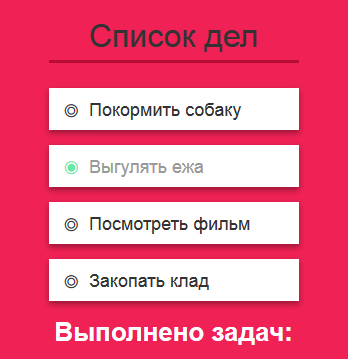

# Задача 1. Список дел

#### В рамках домашнего задания к лекции «Работа с HTML-формами»

## Описание

Вы заканчиваете работу над автоматизированным списком дел и осталось реализовать только счётчик выполненных задач:

Цифра в счётчике под списком должна совпадать с количеством выполненных задач. Выполненной задача считается, когда вы кликаете по ней и чек-бокс слева меняет свое состояние на ◉.

Счётчик должен быть актуальным при открытии и обновляться при изменении состояния пункта списка (нажат или нет чек-бокс).

Если все задачи выполнены – весь текст под списком окрасится в зеленый.

## Интерфейс

Работать надо только с элементами внутри тега с классом `list-block`.

За состояние задачи отвечает тег `<input type="checkbox">`. Если тег находится в состоянии `checked`, то чек-бокс нажат и задача считается выполненной. Поменяйте цифру в счётчике под списком.

Количество выполненных задач выводится в теге `<output>` в формате `3 из 4`, где `3` — количество выполненных задач, а `4` — общее количество задач в списке.

Добавьте тегу с классом `list-block` класс `complete`, если выполнены все задачи в списке (нажат чек-бокс). И удалите этот класс, если хотя бы одна из задач будет помечена как невыполненная.

## Реализация

### В песочнице CODEPEN

В онлайн-песочнице на [CODEPEN](https://codepen.io/Netology/pen/LeBrLR).

### Локально с использованием git

В репозитории на [GitHub](https://github.com/netology-code/hj-homeworks/tree/master/html-forms/todo-list).

## Инструкция по выполнению домашнего задания

### В онлайн-песочнице

Потребуется только ваш браузер.

1. Открыть код в [песочнице](https://codepen.io/Netology/pen/LeBrLR).
2. Нажать кнопку «Fork».
3. Выполнить задание.
4. Нажать кнопку «Save».
5. Скопировать адрес страницы, открытой в браузере.
6. Прислать скопированную ссылку через личный кабинет на сайте [netology.ru](http://netology.ru/).    

### Локально

Потребуются: браузер, редактор кода, система контроля версий [git](https://git-scm.com), установленная локально, и аккаунт на [GitHub](https://github.com/) или [BitBucket](https://bitbucket.org/).

1. Клонировать репозиторий с домашними заданиями `git clone https://github.com/netology-code/hj-homeworks.git`.
2. Перейти в папку задания `cd hj-homeworks/html-forms/todo-list`.
3. Выполнить задание.
4. Создать репозиторий на [GitHub](https://github.com/) или [BitBucket](https://bitbucket.org/).
5. Добавить репозиторий в проект `git remote add homeworks %repo-url%`, где `%repo-url%` — адрес созданного репозитория.
6. Опубликовать код в репозиторий `homeworks` с помощью команды `git push -u homeworks master`.
7. Прислать ссылку на репозиторий через личный кабинет на сайте [netology.ru](http://netology.ru/).
