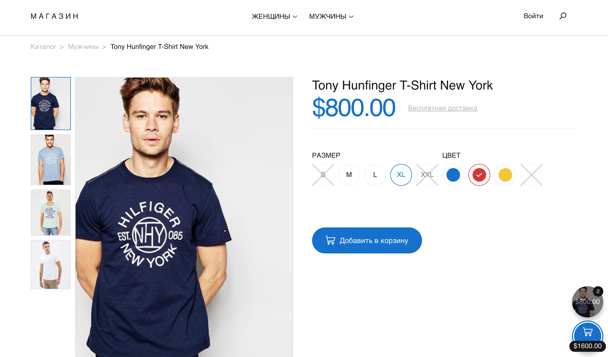

# Задача 3. Корзина

#### В рамках домашнего задания к лекции «Хранение состояния на клиенте и отправка на сервер»

## Описание

Необходимо реализовать форму добавления товара в корзину и работу виджета корзины:



## Интерфейс

Варианты размера подставляются в тело тега с идентификатором `colorSwatch`. Сниппет варианта цвета выглядит следующим образом:
```html
<div data-value="red" class="swatch-element color red available">
  <div class="tooltip">Красный</div>
  <input quickbeam="color" id="swatch-1-red" type="radio" name="color" value="red" checked>
  <label for="swatch-1-red" style="border-color: red;">
    <span style="background-color: red;"></span>
    
  </label>
</div>
```

Обратите внимание на подстановку данных:
- Значение цвета подставляется в атрибуты `data-value` и `class` тега `<div>`, `id` и `value` тега `<input>`, `for` тега `<label>`.
- От доступности товара в данном цвете зависит наличие класса `soldout` или `available` у тега `<div>`, а также наличие атрибута `disabled` у тега `<input>`.
- Описание цвета подставляется в тело тега с классом `tooltip`.
- Код цвета подставляется в атрибут `style` тега `<span>`.
- Если цвет выбран по умолчанию, то в тег `<input>` добавляется атрибут `checked`.

Варианты размера подставляются в тело тега с идентификатором `sizeSwatch`. Сниппет варианта размера выглядит следующим образом:
```html
<div data-value="s" class="swatch-element plain s soldout">
  <input id="swatch-0-s" type="radio" name="size" value="s" disabled>
  <label for="swatch-0-s">
    S
    
  </label>
</div>
```

Обратите внимание на подстановку данных:
- Значение размера подставляется в атрибуты `data-value` и `class` тега `<div>`, `id` и `value` тега `<input>`, `for` тега `<label>`.
- От доступности товара в данном размере зависит наличие класса `soldout` или `available` у тега `<div>`, а также наличие атрибута `disabled` у тега `<input>`.
- Описание размера подставляется в тело тега `<label>`.
- Если размер выбран по умолчанию, то в тег `<input>` добавляется атрибут `checked`.

Корзина доступна в теге с идентификатором `quick-cart`. Сначала идут сниппеты товаров. Сниппет товара в корзине выглядит следующим образом:
```html
<div class="quick-cart-product quick-cart-product-static" id="quick-cart-product-2721888517" style="opacity: 1;">
  <div class="quick-cart-product-wrap">
    
    <span class="s1" style="background-color: #000; opacity: .5">$800.00</span>
    <span class="s2"></span>
  </div>
  <span class="count hide fadeUp" id="quick-cart-product-count-2721888517">1</span>
  <span class="quick-cart-product-remove remove" data-id="2721888517"></span>
</div>
```

Обратите внимание на подстановку данных:
- Идентификатор товара подставляется в атрибут `id` тега `<div>`, в атрибут `id` тега `<span>` и в атрибут `data-id` тега с классом `remove`.
- Адрес картинки подставляется в атрибут `src` тега ``.
- Название товара подставляется в атрибут `title` тега ``.
- Количество товара в корзине подставляется в тело тега с классом `count`.

Сниппет корзины идет сразу после сниппетов товаров:
```html
<a id="quick-cart-pay" quickbeam="cart-pay" class="cart-ico open">
  <span>
    <strong class="quick-cart-text">Оформить заказ<br></strong>
    <span id="quick-cart-price">$800.00</span>
  </span>
</a>
```

Подстановка данных:
- Если в корзине нет товаров, то класс `open` необходимо удалить.
- Общая стоимость всех товаров выводится в тег с идентификатором `quick-cart-price`.

Форма отправки заказа имеет идентификатор `AddToCartForm`.

Кнопка удаления товара из корзины имеет класс `remove`. Идентификатор удаляемого товара можно получить из атрибута `data-id`.

## Данные

Для получения списка доступных цветов запросите JSON по адресу `https://neto-api.herokuapp.com/cart/colors`. Вам будут доступны следующие данные по каждому цвету:
- `title` — описание цвета;
- `type` — значение цвета, для сохранения в корзине;
- `code` — код цвета, для отображения фона;
- `isAvailable` — доступность товара в данном цвете.

Для получения списка доступных размеров запросите JSON по адресу `https://neto-api.herokuapp.com/cart/sizes`. Вам будут доступны следующие данные по каждому размеру:
- `title` — описание размера;
- `type` — значение размера, для сохранения в корзине;
- `isAvailable` — доступность товара данного размера.

Для получения текущего состояния корзины запросите JSON по адресу `https://neto-api.herokuapp.com/cart`. Вам будут доступны следующие данные по каждому товару:
- `color` — цвет товара;
- `id` — идентификатор товара;
- `pic` — адрес картинки товара;
- `price` — цена товара;
- `quantity` — количество единиц товара в корзине;
- `size` — размер товара;
- `title` — название товара.

## Функционал

При открытии страницы необходимо отобразить выбор размера и цвета с учетом доступности.

Любые изменения размера и цвета должны запоминаться на стороне клиента, и при повторном открытии должно быть выбрано последнее актуальное значение.

При нажатии на кнопку «Добавить в корзину» необходимо отправить данные формы методом POST на адрес `https://neto-api.herokuapp.com/cart`. Данные формы необходимо дополнить идентификатором товара. Он доступен в атрибуте `data-product-id` формы. Его нужно отправить в запросе полем `productId`.

В случае успеха вернется новое состояние корзины — обновите корзину, используя эти данные. В случае ошибки вы получите объект со свойством `error`, равным `true`, и свойством `message` с описанием причины ошибки.

Для удаления товара из корзины отправьте его идентификатор полем `productId` на адрес `https://neto-api.herokuapp.com/cart/remove` методом POST. В случае успеха вы получите новое состояние корзины. Ошибка выглядит так же, как и при добавлении.

## Реализация

При реализации нельзя изменять HTML-код и CSS-стили.

### В песочнице CodePen

Реализуйте функционал во вкладке JS.

В онлайн-песочнице на [CODEPEN](https://codepen.io/Netology/pen/aEjKxp).

### Локально с использованием git

Реализацию необходимо поместить в файл `./js/cart.js`. Файл уже подключен к документу, поэтому другие файлы изменять не требуется.

В репозитории на [GitHub](https://github.com/netology-code/hj-homeworks/tree/master/local-storage/cart).

## Инструкция по выполнению домашнего задания

### В онлайн-песочнице

Потребуется только ваш браузер.

1. Открыть код в [песочнице](https://codepen.io/Netology/pen/aEjKxp).
2. Нажать кнопку «Fork».
3. Выполнить задание.
4. Нажать кнопку «Save».
5. Скопировать адрес страницы, открытой в браузере.
6. Прислать скопированную ссылку через личный кабинет на сайте [netology.ru](http://netology.ru/).    

### Локально

Потребуются: браузер, редактор кода, система контроля версий [git](https://git-scm.com), установленная локально, и аккаунт на [GitHub](https://github.com/) или [BitBucket](https://bitbucket.org/).

1. Клонировать репозиторий с домашними заданиями `git clone https://github.com/netology-code/hj-homeworks.git`.
2. Перейти в папку задания `cd hj-homeworks/local-storage/cart`.
3. Выполнить задание.
4. Создать репозиторий на [GitHub](https://github.com/) или [BitBucket](https://bitbucket.org/).
5. Добавить репозиторий в проект `git remote add homeworks %repo-url%`, где `%repo-url%` — адрес созданного репозитория.
6. Опубликовать код в репозиторий `homeworks` с помощью команды `git push -u homeworks master`.
7. Прислать ссылку на репозиторий через личный кабинет на сайте [netology.ru](http://netology.ru/).
