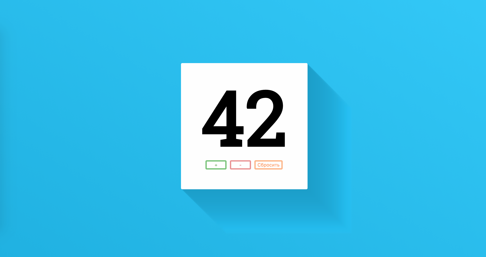

Персональный счетчик
===

Необходимо реализовать простой персональный счетчик, который запоминает своё текущее состояние.

## Интерфейс

Для отображения текущего значения счетчика используйте узел с идентификатором `counter`.

Так же реализуйте обработку клика на следующие кнопки:
- «+» — идентификатор `increment`
- «-» — идентификатор `decrement`
- «Сбросить» — идентификатор `reset`

## Функционал

При открытии страницы счетчик должен показывать значение `0`, либо последнее значение, которое было на момент закрытия окна браузера.

Каждый пользователь, открывший страницу счетчика видит своё состояние счетчика. Другие пользователи не могут на него повлиять. Но если пользователь пользовался счетчиком из одного браузера, и потом открыл счетчик в другом, то счетчик начинается с `0`.

При клике на кнопку «+» значение счетчика увеличивается на `1`. При клике на кнопку «-» — уменьшается на `1` только если текущее значение больше `0`. При клике на кнопку «Сбросить» — текущее значение устанавливается в `0`.

## Реализация

При реализации нельзя изменять HTML-код и CSS-стили.

### Локально с использованием git

Реализацию необходимо поместить в файл `./js/counter.js`. Файл уже подключен к документы, поэтому другие файлы изменять не требуется.

### В песочнице CodePen

Реализуйте функционал вкладке JS. Перед началом работы сделайте форк этого пена:

https://codepen.io/dfitiskin/pen/rzeoBe
