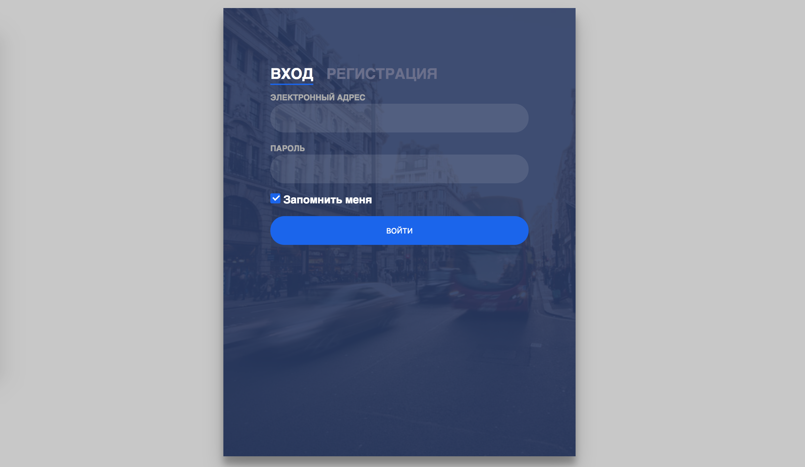

# Задача 2. Форма авторизации и регистрации

#### В рамках домашнего задания к лекции «Хранение состояния на клиенте и отправка на сервер»

## Описание

Реализуйте работу форм входа и регистрации:

## Интерфейс

Вам потребуются две формы:
- Форма входа, имеет класс `sign-in-htm`.
- Форма регистрации, имеет класс `sign-up-htm`.

В каждой из форм есть поле `output` для вывода сообщений с классом `error-message`.

## Функционал

При отправке формы входа необходимо отправить данные формы POST-запросом на адрес `https://neto-api.herokuapp.com/signin` в JSON-формате.

При отправке формы регистрации необходимо отправить данные формы POST-запросом на адрес `https://neto-api.herokuapp.com/signup` в JSON-формате.

Оба запроса имеют идентичные форматы ответа. В случае ошибки возвращается JSON-объект со свойствами:
- `error` — состояние ошибки, будет равно `true`;
- `message` — сообщение об ошибке.

В случае успеха будет возвращен объект пользователя со свойствами:
- `email` — электронная почта пользователя;
- `name` — имя пользователя.

В случае ошибки необходимо вывести сообщение об ошибке в поле для сообщений. В случае успеха необходимо вывести одну из двух шаблонных фраз:
- «Пользователь Иван успешно авторизован» — в случае успешного входа.
- «Пользователь Иван успешно зарегистрирован» — в случае успешной регистрации.

## Реализация

При реализации нельзя изменять HTML-код и CSS-стили.

### В песочнице CodePen

Реализуйте функционал во вкладке JS.

В онлайн-песочнице на [CODEPEN](https://codepen.io/Netology/pen/vparbd).

### Локально с использованием git

Реализацию необходимо поместить в файл `./js/auth.js`. Файл уже подключен к документу, поэтому другие файлы изменять не требуется.

В репозитории на [GitHub](https://github.com/netology-code/hj-homeworks/tree/master/local-storage/sign-in-form).

## Инструкция по выполнению домашнего задания

### В онлайн-песочнице

Потребуется только ваш браузер.

1. Открыть код в [песочнице](https://codepen.io/Netology/pen/vparbd).
2. Нажать кнопку «Fork».
3. Выполнить задание.
4. Нажать кнопку «Save».
5. Скопировать адрес страницы, открытой в браузере.
6. Прислать скопированную ссылку через личный кабинет на сайте [netology.ru](http://netology.ru/).    

### Локально

Потребуются: браузер, редактор кода, система контроля версий [git](https://git-scm.com), установленная локально, и аккаунт на [GitHub](https://github.com/) или [BitBucket](https://bitbucket.org/).

1. Клонировать репозиторий с домашними заданиями `git clone https://github.com/netology-code/hj-homeworks.git`.
2. Перейти в папку задания `cd hj-homeworks/local-storage/sign-in-form`.
3. Выполнить задание.
4. Создать репозиторий на [GitHub](https://github.com/) или [BitBucket](https://bitbucket.org/).
5. Добавить репозиторий в проект `git remote add homeworks %repo-url%`, где `%repo-url%` — адрес созданного репозитория.
6. Опубликовать код в репозиторий `homeworks` с помощью команды `git push -u homeworks master`.
7. Прислать ссылку на репозиторий через личный кабинет на сайте [netology.ru](http://netology.ru/).
