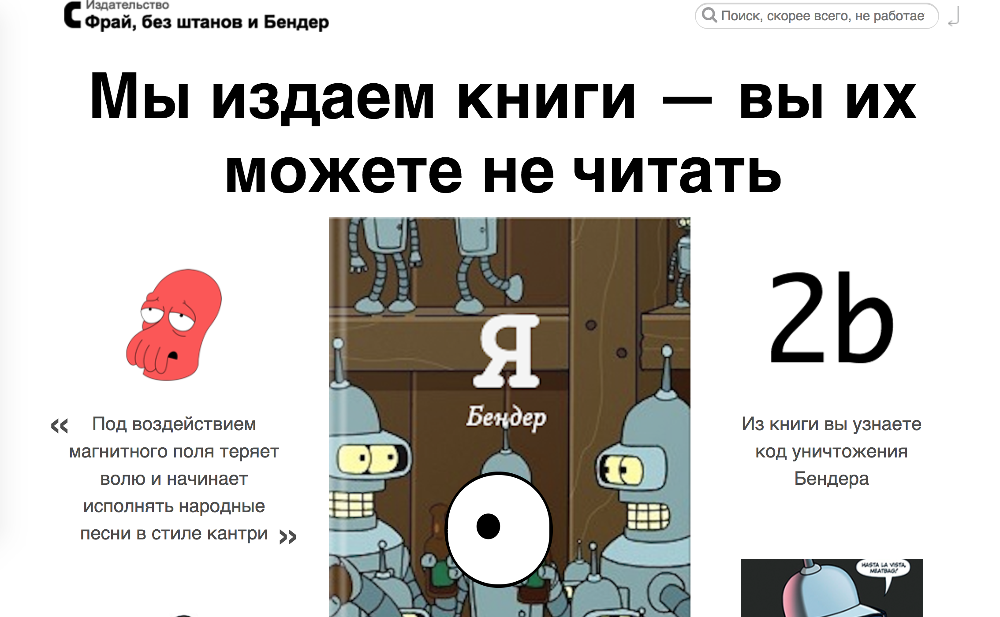

Зомбирующий глаз
===

Юзабилити-тесты показали, что если внимательно наблюдать за посетителем сайта, то он начинает смущаться и делать что-то, чего делать не планировал. Например, оформить заказ на книгу, которую не хотел покупать. Поэтому владельцы интернет-магазина «Фрай, без штанов и Бендер» просят нас добавить на страницу книги глаз, который бы внимательно наблюдал за курсором мыши.



## Интерфейс

Наш верстальщик уже реализовал глаз, и зрачок, и даже подмигивание при помощи CSS. И даже сделал заготовку для его перемещения, использовав 3 собственных CSS-свойства для задания позиции и размера:
* `--pupil-x` — смещение зрачка от центра по оси X;
* `--pupil-y` — смещение зрачка от центра по оси Y;
* `--pupil-size` — размер зрачка;

Вам остаётся только задать эти свойства для узла `.big-book__pupil` с помощью метода `setProperty` свойства `style`. Например, этот код увеличит размер зрачка в два раза:
```javascript
document.querySelector('.big-book__pupil').style.setProperty('--pupil-size', 2);
```

## Значения свойств

Размер зрачка должен меняться в диапазоне от `1` до `3`. При этом должно быть значение `1`, когда курсор мыши находится близко к краю окна браузера. А значение `3` — когда курсор мыши находится непосредственно около глаза.

Смещения по обеим осям должны находиться в диапазоне от `-30px` до `30px`. Пропорционально тому, насколько курсор мыши далеко от центра глаза.

## Реализация

При реализации нельзя изменять HTML-код и CSS-стили.

### Локально с использованием git

Реализацию необходимо поместить в файл `./js/animation.js`. Файл уже подключен к документу, поэтому другие файлы изменять не требуется.

### В песочнице CodePen

Реализуйте функционал во вкладке JS. Перед началом работы сделайте форк этого пена:

https://codepen.io/dfitiskin/pen/XzErMJ
