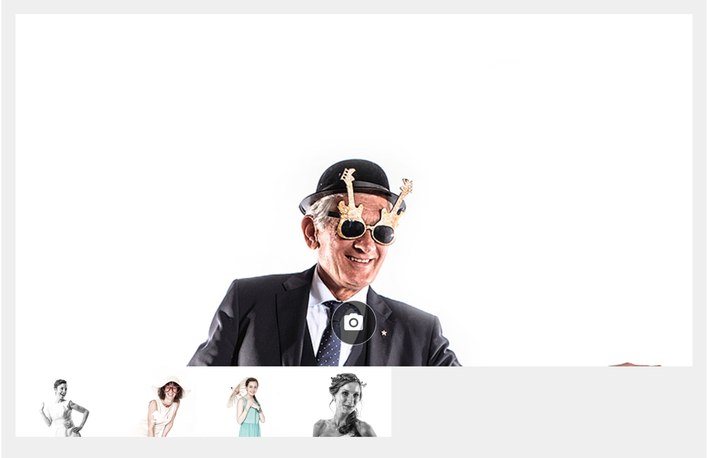

# Задача 1. Фотобудка

#### В рамках домашнего задания к лекции «Работа с медиа-ресурсами»

## Описание

Вам необходимо реализовать приложение «Фотобудка», которое позволяет сделать селфи прямо в браузере, сохранить понравившиеся снимки себе на компьютер или опубликовать в [фотопоток](https://neto-api.herokuapp.com/hj/5.1/photobooth/):


## Принцип работы

1. Проверяем доступность необходимых API. Если их нет, показываем ошибку.
2. Запрашиваем доступ к веб-камере. Если доступ не предоставлен, показываем ошибку.
3. Отображаем видео с веб-камеры.
4. При клике на кнопке «Сделать снимок» помещаем текущий кадр видео на холст.
5. Получаем изображение с холста и отображаем его в списке готовых фотографий.
6. При клике на кнопке «Загрузить» отправляем выбранное фото на сервер.
7. При клике на кнопке «Скачать» сохраняем выбранное фото на диске.
8. При клике на кнопке «Удалить» удаляем фото из списка.

## Интерфейс

Интерфейс приложения состоит из двух ключевых компонентов:
- `.app` — съемка фото;
- `.list` — список фотографий.

### Съемка фото

- `#error-message` — поле для вывода сообщений об ошибках;
- `#take-photo` — кнопка создания снимка.

Потребуется отобразить видео с веб-камеры, чтобы пользователь мог видеть себя в момент съемки.

При создании снимка должен проигрываться файл [`./audio/click.mp3`](https://raw.githubusercontent.com/netology-code/hj-homeworks/master/media/photo-booth/audio/click.mp3), имитирующий щелчок затвора фотоаппарата.

Недостающие элементы необходимо создать скриптом при инициализации приложения.

### Список фотографий

Карточка фотографии в списке имеет следующий HTML-код:
```html
<figure>
  
  <figcaption>
    <a href="path/to/pic.png" download="snapshot.png">
      <i class="material-icons">file_download</i>
    </a>
    <a><i class="material-icons">file_upload</i></a>
    <a><i class="material-icons">delete</i></a>
  </figcaption>
</figure>
```

Новые фотографии добавляются в начало списка. При клике на ссылки должны выполняться следующие действия, по порядку:
- скачивание изображения (достигается за счет атрибутов `download` и `href`);
- загрузка изображения на сервер (смотрите раздел «Данные»);
- удаление изображения из списка.

После скачивания и загрузки изображения соответствующие им кнопки отображаться не должны.

## Данные

Для отправки фотографии в [фотопоток](https://neto-api.herokuapp.com/hj/5.1/photobooth/) необходимо отправить POST-запрос на адрес:

https://neto-api.herokuapp.com/photo-booth

Запрос должен быть сформирован как `multipart/form-data`, а изображение — отправлено полем `image`. В ответ в случае успеха придет публичный URL-адрес изображения. При этом изображение появится в фотопотоке.

Функция удаления будет удалять фотографии из списка. Средств удаления фотографии из фотопотока нет.

## Тестирование приложения

Вероятно, у некоторых из вас не окажется веб-камеры или браузера, в котором работает `navigator.getUserMedia`. Что же делать, если вы один из таких «счастливчиков»?

А что бы вы делали в том случае, если бы это была реальная задача из реального проекта? Возможны всего три варианта:
- Не браться за задачу.
- Решать задачу вслепую.
- Получить доступ к веб-камере и нормальному браузеру на время тестирования.

Эти же три варианта доступны вам и сейчас. Естественно, если вы не беретесь за эту задачу, то зачет по всему заданию получить не удастся. Вероятность решить вслепую тоже крайне низка.

## Реализация

При реализации нельзя изменять HTML-код и CSS-стили.

### Локально с использованием git

Реализацию необходимо поместить в файл `./js/script.js`. Файл уже подключен к документу, поэтому другие файлы изменять не требуется.

### В песочнице CodePen

Реализуйте функционал во вкладке JS.

В онлайн-песочнице на [CODEPEN](https://codepen.io/Netology/pen/eyjjZd).

## Инструкция по выполнению домашнего задания

### В онлайн-песочнице

Потребуется только ваш браузер.

1. Открыть код в [песочнице](https://codepen.io/Netology/pen/eyjjZd).
2. Нажать кнопку «Fork».
3. Выполнить задание.
4. Нажать кнопку «Save».
5. Скопировать адрес страницы, открытой в браузере.
6. Прислать скопированную ссылку через личный кабинет на сайте [netology.ru](http://netology.ru/).    

### Локально

Потребуются: браузер, редактор кода, система контроля версий [git](https://git-scm.com), установленная локально, и аккаунт на [GitHub](https://github.com/) или [BitBucket](https://bitbucket.org/).

1. Клонировать репозиторий с домашними заданиями `git clone https://github.com/netology-code/hj-homeworks.git`.
2. Перейти в папку задания `cd hj-homeworks/media/photo-booth`.
3. Выполнить задание.
4. Создать репозиторий на [GitHub](https://github.com/) или [BitBucket](https://bitbucket.org/).
5. Добавить репозиторий в проект `git remote add homeworks %repo-url%`, где `%repo-url%` — адрес созданного репозитория.
6. Опубликовать код в репозиторий `homeworks` с помощью команды `git push -u homeworks master`.
7. Прислать ссылку на репозиторий через личный кабинет на сайте [netology.ru](http://netology.ru/).
