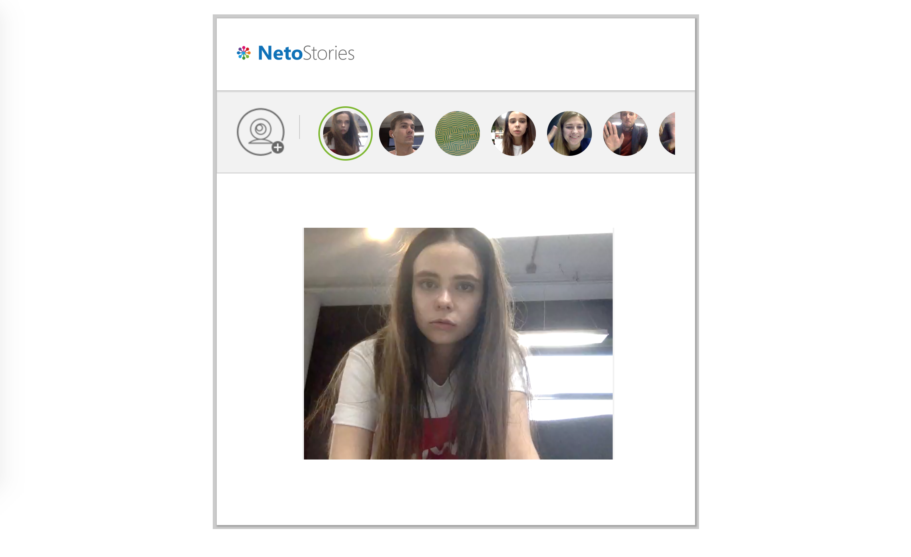

# Задача 3. NetoStories

#### В рамках домашнего задания к лекции «Работа с медиа-ресурсами»

## Описание

Новый продуктолог Нетологии решил внедрить в личный кабинет студентов функционал историй: возможность записать и поделиться коротким видео. Студенты смогут публиковать свои видео и смотреть видео одногруппников.



## Функционал

Большая часть функционала историй уже реализована. Вам осталось реализовать только самую ключевую функцию — запись короткого видео с помощью веб-камеры.

Для этого вам необходимо реализовать функцию `record`. Сейчас там реализована заглушка этой функции.

Функция должна принимать следующие аргументы:
1. `app` — приложение, которое позволяет управлять интерфейсом приложения, _объект_.

Аргумент `app` содержит следующие необходимые для работы функции поля:
1. `config` — конфигурация медиа-устройства, необходимого для записи видео, _объект_.
2. `limit` — длина видео в миллисекундах, _число_.

Функция должна вернуть промис (`Promise`), который разрешится объектом со следующими свойствами:
* `video` — записанное видео, `Blob`;
* `frame` — кадр из видео, `Blob`.

Также во время записи необходимо управлять состоянием интерфейса через объект приложения `app`. Свойство `mode` этого объекта позволяет перевести интерфейс в то или иное состояние. Доступны следующие состояния:
* `preparing` — приложение готовится к началу записи,
* `recording` — идет запись видео,
* `sending` — видео записано, идет отправка видео на сервер,
* `sended` — видео успешно отправлено.

Сразу при вызове функции `record` необходимо установить состояние `preparing`:
```javascript
app.mode = 'preparing';
```

После того, как доступ к камере получен и вы готовы начать запись, переключите режим в `recording`. На этом этапе также важно направить видеопоток с камеры в окно предварительного просмотра, чтобы пользователь видел, что записывает. Для этого у объекта `app` есть свойство `preview` — это ссылка на элемент `video`. Направить поток `stream` можно, например, так:
```javascript
app.preview.srcObject = stream;
```

При этом непосредственно запись рекомендуем начинать через одну секунду с момента включения камеры.

Запись необходимо остановить скриптом спустя количество миллисекунд, заданное в `app.limit`.

Отключите предварительный просмотр с камеры:
```javascript
app.preview.srcObject = null;
```

После остановки выключите камеру. Это можно сделать с помощью следующей команды:
```javascript
stream.getTracks().forEach(track => track.stop())
```

Создайте кадр из видео с помощью функции `createThumbnail` (описана далее), и полученные `Blob`-объекты видео и изображения разрешите в промис, как описано выше.

В случае любых ошибок переведите промис в статус `rejected` с объектом ошибки. Самостоятельно обрабатывать ошибки не требуется.

## Дополнительные функции

`createThumbnail` — позволяет получить кадр из видео. Принимает видео в формате `Blob`, возвращает промис (`Promise`), который разрешится изображением в формате `Blob`.

Также добавлен полифилл для работы `navigator.mediaDevices.getUserMedia` в браузерах, которые имеют нестандартную реализацию.

## Реализация

При реализации нельзя изменять HTML-код и CSS-стили.

### Локально с использованием git

Реализацию необходимо поместить в файл `./js/recorder.js`. Файл уже подключен к документу, поэтому другие файлы изменять не требуется.

### В песочнице CodePen

Реализуйте функционал во вкладке JS.

В онлайн-песочнице на [CODEPEN](https://codepen.io/Netology/pen/eyjjzd).

## Инструкция по выполнению домашнего задания

### В онлайн-песочнице

Потребуется только ваш браузер.

1. Открыть код в [песочнице](https://codepen.io/Netology/pen/eyjjzd).
2. Нажать кнопку «Fork».
3. Выполнить задание.
4. Нажать кнопку «Save».
5. Скопировать адрес страницы, открытой в браузере.
6. Прислать скопированную ссылку через личный кабинет на сайте [netology.ru](http://netology.ru/).    

### Локально

Потребуются: браузер, редактор кода, система контроля версий [git](https://git-scm.com), установленная локально, и аккаунт на [GitHub](https://github.com/) или [BitBucket](https://bitbucket.org/).

1. Клонировать репозиторий с домашними заданиями `git clone https://github.com/netology-code/hj-homeworks.git`.
2. Перейти в папку задания `cd hj-homeworks/media/stories`.
3. Выполнить задание.
4. Создать репозиторий на [GitHub](https://github.com/) или [BitBucket](https://bitbucket.org/).
5. Добавить репозиторий в проект `git remote add homeworks %repo-url%`, где `%repo-url%` — адрес созданного репозитория.
6. Опубликовать код в репозиторий `homeworks` с помощью команды `git push -u homeworks master`.
7. Прислать ссылку на репозиторий через личный кабинет на сайте [netology.ru](http://netology.ru/).
