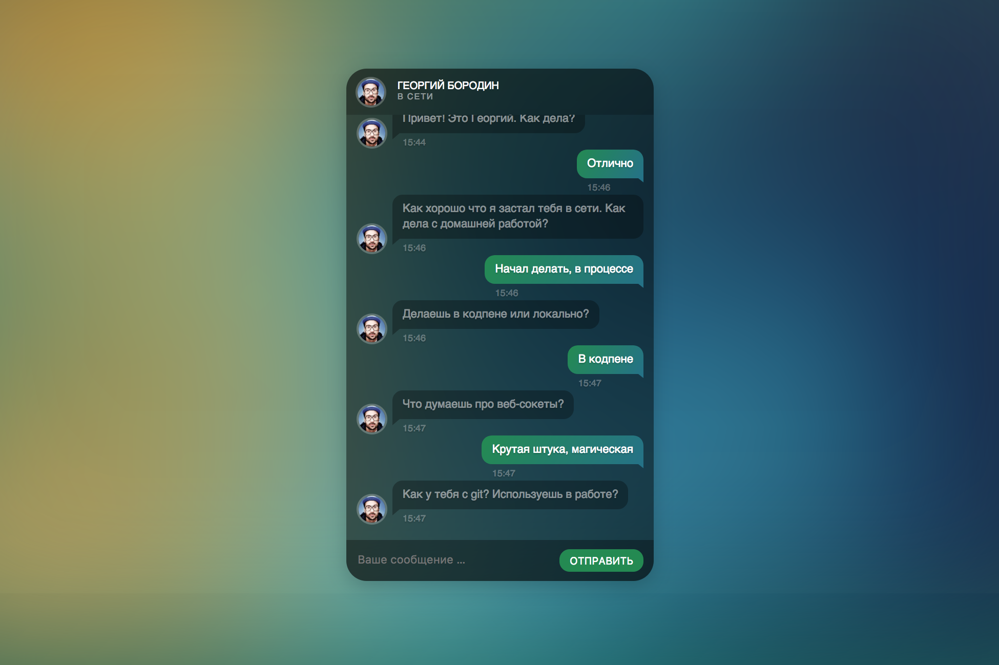

# Задача 3. Чат с одногруппником

#### В рамках домашнего задания к лекции «Веб-сокеты»

## Описание

В вашу задачу входит оживить интерфейс чата:

## Интерфейс

Весь интерфейс чата сосредоточен в теге с классом `chat`. Выполняйте поиск компонентов чата только в нём.

Форма отправки нового сообщения имеет класс `message-box`. Поле ввода сообщения имеет класс `message-input`. Кнопка «Отправить сообщение» имеет класс `message-submit`.

Все новые сообщения для отображения необходимо отображать в блоке с классом `messages-content`. Есть четыре типа сообщений. Их шаблоны доступны в скрытом контейнере с классом `messages-templates`, у всех имеется класс `message`:

1. Сообщение с классом `loading` — информация о том, что собеседник сейчас печатает сообщение.
2. Сообщение от собеседника без дополнительного класса и сообщение от пользователя с классом `message-personal` имеют элементы с классами `message-text` и `timestamp`, в тела которых следует поместить текст сообщения и время добавления.
3. Сообщение с классом `message-status` — вывод разных уведомлений. Также имеет элемент с классами `message-text` для вывода текста уведомления.

Элемент с классом `chat-status`. Необходимо использовать для вывода состояния чата. Если собеседник в сети, то следует подставить в тело текст из атрибута `data-online`, иначе — из `data-offline`.

## Функционал

При открытии страницы необходимо установить соединение с веб-сокетом по адресу `wss://neto-api.herokuapp.com/chat`.

Если соединение успешно установлено, необходимо обновить статус чата, а также активировать кнопку «Отправить сообщение» и вывести уведомление с текстом «Пользователь появился в сети».

При получении сообщения по веб-сокет соединению необходимо проверить текст сообщения. Если он равен `...` (три точки), то необходимо отобразить информацию о том, что собеседник сейчас печатает сообщение. Если текст сообщения другой, то необходимо отобразить сообщение с этим текстом. А информацию о том, что собеседник печатает, необходимо удалить.

При отправке сообщения пользователем через форму (кнопка «Отправить сообщение» или клавиша `Enter` в поле ввода сообщения) необходимо текст сообщения отправить по веб-сокет соединению и отобразить сообщение пользователя в общем списке.

Время сообщений в обоих случаях берем текущее на момент отображения. Учитывайте, что часы и минуты всегда должны иметь 2 символа, например, `09:03`.

Если соединение с веб-сокет сервером закрывается, то необходимо поменять статус чата и деактивировать кнопку «Отправить сообщение», а также вывести уведомление с текстом «Пользователь не в сети».

## Реализация

При реализации нельзя изменять HTML-код и CSS-стили.

### В песочнице CodePen

Реализуйте функционал во вкладке JS. 

В онлайн-песочнице на [CODEPEN](https://codepen.io/Netology/pen/wpxXLN).

### Локально с использованием git

Реализацию необходимо поместить в файл `./js/chat.js`. Файл уже подключен к документу, поэтому другие файлы изменять не требуется.

В репозитории на [GitHub](https://github.com/netology-code/hj-homeworks/tree/master/websocket/chat).

## Инструкция по выполнению домашнего задания

### В онлайн-песочнице

Потребуется только ваш браузер.

1. Открыть код в [песочнице](https://codepen.io/Netology/pen/wpxXLN).
2. Нажать кнопку «Fork».
3. Выполнить задание.
4. Нажать кнопку «Save».
5. Скопировать адрес страницы, открытой в браузере.
6. Прислать скопированную ссылку через личный кабинет на сайте [netology.ru](http://netology.ru/).    

### Локально

Потребуются: браузер, редактор кода, система контроля версий [git](https://git-scm.com), установленная локально, и аккаунт на [GitHub](https://github.com/) или [BitBucket](https://bitbucket.org/).

1. Клонировать репозиторий с домашними заданиями `git clone https://github.com/netology-code/hj-homeworks.git`.
2. Перейти в папку задания `cd hj-homeworks/websocket/chat`.
3. Выполнить задание.
4. Создать репозиторий на [GitHub](https://github.com/) или [BitBucket](https://bitbucket.org/).
5. Добавить репозиторий в проект `git remote add homeworks %repo-url%`, где `%repo-url%` — адрес созданного репозитория.
6. Опубликовать код в репозиторий `homeworks` с помощью команды `git push -u homeworks master`.
7. Прислать ссылку на репозиторий через личный кабинет на сайте [netology.ru](http://netology.ru/).
