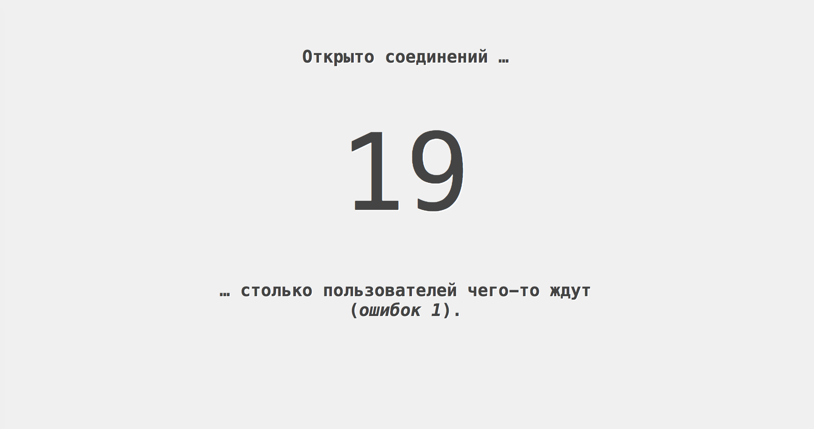

# Задача 2. Счетчик открытых соединений

#### В рамках домашнего задания к лекции «Веб-сокеты»

## Описание

Вам необходимо отобразить информацию о количестве открытых веб-сокет соединений с сервером, а также о количестве ошибок при закрытии соединения.

## Интерфейс

Для отображения количества открытых соединений поместите их количество в тело тега с классом `counter`.

Для отображения количества ошибок при закрытии соединения поместите их в тег `output.errors`.

## Функционал

При открытии страницы необходимо установить веб-сокет соединение с сервером `wss://neto-api.herokuapp.com/counter`.

При закрытии страницы необходимо закрыть соединение с кодом `1000`.

По веб-сокет соединению передаются актуальные данные о количестве открытых соединений и количестве ошибок в формате JSON-объекта с ключами:
- `connections` — количество открытых соединений,
- `errors` — количество ошибок закрытия.

Вам необходимо обновлять эту информацию на странице.

## Реализация

При реализации нельзя изменять HTML-код и CSS-стили.

### Локально с использованием git

Реализацию необходимо поместить в файл `./js/counter.js`. Файл уже подключен к документу, поэтому другие файлы изменять не требуется.

### В песочнице CodePen

Реализуйте функционал во вкладке JS. 

В онлайн-песочнице на [CODEPEN](https://codepen.io/dfitiskin/pen/awPoaw).

### Инструкция по выполнению домашнего задания

#### В онлайн-песочнице

Потребуется: только ваш браузер.

1. Открыть код в [песочнице](https://codepen.io/dfitiskin/pen/awPoaw).

2. Нажать на кнопку «Fork».

3. Выполнить задание.

4. Нажать кнопку «Save».

5. Скопировать адрес страницы, открытой в браузере.

6. Прислать скопированную ссылку через личный кабинет на сайте [netology.ru](http://netology.ru/).    

#### Локально

Потребуется: браузер, редактор кода, система контроля версий [git](https://git-scm.com), установленная локально, и аккаунт на [GitHub](https://github.com/) или [BitBucket](https://bitbucket.org/).

1. Клонировать репозиторий с домашними заданиями `git clone https://github.com/netology-code/hj-homeworks.git`.

2. Перейти в папку задания `cd hj-homeworks/websocket/counter`.

3. Выполнить задание.

4. Создать репозиторий на [GitHub](https://github.com/) или [BitBucket](https://bitbucket.org/).

5. Добавить репозиторий в проект `git remote add homeworks %repo-url%`, где `%repo-url%` — адрес созданного репозитория.

6. Опубликовать код в репозиторий `homeworks` с помощью команды `git push -u homeworks master`.

7. Прислать ссылку на репозиторий через личный кабинет на сайте [netology.ru](http://netology.ru/).
