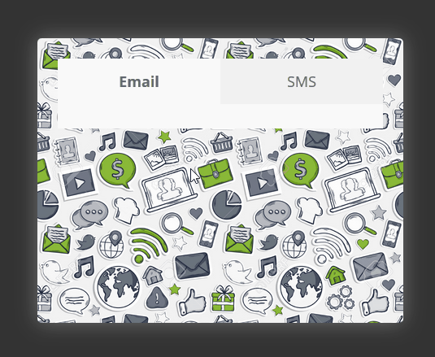

# Задача 2. Табы

#### В рамках домашнего задания к лекции «Асинхронные HTTP-запросы»

## Описание

Реализуйте функционал переключения между вкладками с разным контентом. При клике на заголовок «Email» в окне необходимо отобразить форму подписки на email-рассылку. При клике на заголовок «SMS» нужно отобразить поле ввода телефона и кнопку `Отправить код`:

## Требования

- Содержимое таба «Email» должно быть показано сразу при открытии страницы.
- Содержимое табов нельзя помещать в основной файл вручную. Его необходимо получать асинхронным запросом при активации таба.
- Текущий таб должен быть выделен. Одновременно может быть выбран только один таб.
- Во время ожидания ответа и загрузки данных должен появляться индикатор загрузки.

## Интерфейс

- Заголовки табов реализованы тегами `<a>` в теге `<nav>`.
- Адрес, по которому необходимо получить содержимое таба, нужно получить из атрибута `href` ссылки.
- Переход по ссылке при клике на ней осуществляться не должен.
- Содержимое активного таба необходимо поместить в тело тега `
`.
- Чтобы выделить активный таб, ему необходимо добавить класс `active`.
- Индикатор загрузки реализован в теге `
`.
- Чтобы показать прелоадер, у него необходимо удалить класс `hidden`.

## Реализация

### В песочнице REPL.IT

В онлайн-песочнице на [REPL.IT](https://repl.it/HTkM/4).

### Локально с использованием git

В репозитории на [GitHub](https://github.com/netology-code/hj-homeworks/tree/master/xhr/tabs).

## Инструкция по выполнению домашнего задания

### В онлайн-песочнице

Потребуется только ваш браузер.

1. Открыть код в [песочнице](https://repl.it/HTkM/4).
2. Нажать кнопку «Fork».
3. Выполнить задание.
4. Нажать кнопку «Save».
5. Нажать кнопку Share и скопировать ссылку из поля Share link.
6. Прислать скопированную ссылку через личный кабинет на сайте [netology.ru]((http://netology.ru/)).

### Локально

Потребуются: браузер, редактор кода, система контроля версий [git](https://git-scm.com), установленная локально, и аккаунт на [GitHub](https://github.com/) или [BitBucket](https://bitbucket.org/).

1. Клонировать репозиторий с домашними заданиями `git clone https://github.com/netology-code/hj-homeworks.git`.
2. Перейти в папку задания `cd hj-homeworks/xhr/tabs`.
3. Выполнить задание.
4. Создать репозиторий на [GitHub](https://github.com/) или [BitBucket](https://bitbucket.org/).
5. Добавить репозиторий в проект `git remote add homeworks %repo-url%`, где `%repo-url%` — адрес созданного репозитория.
6. Опубликовать код в репозиторий `homeworks` с помощью команды `git push -u homeworks master`.
7. Прислать ссылку на репозиторий через личный кабинет на сайте [netology.ru](http://netology.ru/).
