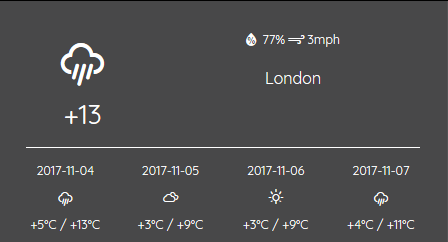

# Задача 1. Виджет погоды

#### В рамках домашнего задания к лекции «Асинхронные HTTP-запросы»

## Описание

Страница с виджетом погоды долго грузится и в процессе загрузки не реагирует на события пользователя. Это не позволяет встроить код страницы в реальный проект, где есть и другие функции. Вероятнее всего, причина в существующем JavaScript-коде виджета. Перепишите скрипт так, чтобы в процессе загрузки данных виджета страница не подвисала:

## Интерфейс

Вам нужно изменить существующий JavaScript-код страницы так, чтобы сама страница реагировала на любые события, и при этом виджет погоды отображал данные в том же виде.

## Реализация

### В песочнице CODEPEN

В онлайн-песочнице на [CODEPEN](https://codepen.io/Netology/pen/vparxZ).

Перепишите код, написанный в окне JS.

### Локально с использованием git

В репозитории на [GitHub](https://github.com/netology-code/hj-homeworks/tree/master/xhr/weather-widget).

При работе с файлами из репозитория следует переписать содержимое файла `main.js`.

## Инструкция по выполнению домашнего задания

### В онлайн-песочнице

Потребуется только ваш браузер.

1. Открыть код в [песочнице](https://codepen.io/Netology/pen/vparxZ).
2. Нажать кнопку «Fork».
3. Выполнить задание.
4. Нажать кнопку «Save».
5. Скопировать адрес страницы, открытой в браузере.
6. Прислать скопированную ссылку через личный кабинет на сайте [netology.ru](http://netology.ru/).    

### Локально

Потребуются: браузер, редактор кода, система контроля версий [git](https://git-scm.com), установленная локально, и аккаунт на [GitHub](https://github.com/) или [BitBucket](https://bitbucket.org/).

1. Клонировать репозиторий с домашними заданиями `git clone https://github.com/netology-code/hj-homeworks.git`.
2. Перейти в папку задания `cd hj-homeworks/xhr/weather-widget`.
3. Выполнить задание.
4. Создать репозиторий на [GitHub](https://github.com/) или [BitBucket](https://bitbucket.org/).
5. Добавить репозиторий в проект `git remote add homeworks %repo-url%`, где `%repo-url%` — адрес созданного репозитория.
6. Опубликовать код в репозиторий `homeworks` с помощью команды `git push -u homeworks master`.
7. Прислать ссылку на репозиторий через личный кабинет на сайте [netology.ru](http://netology.ru/).
